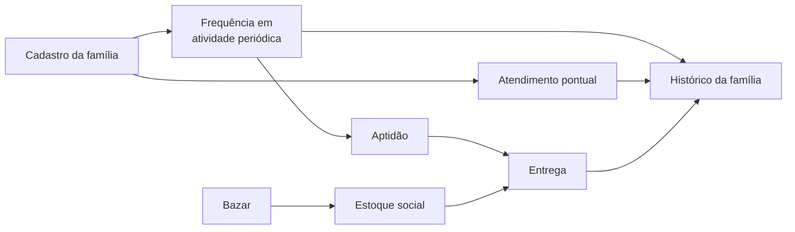
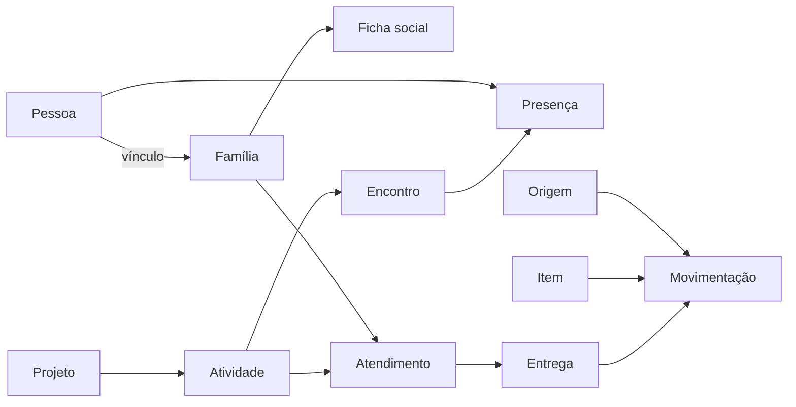
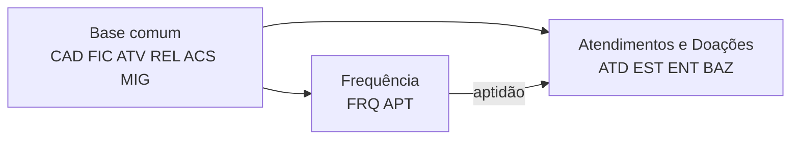

# Especificação de Requisitos de Software — ERP Social Luz da Esperança

Sep 24, 2026 · @Ruan Pedro

## Controle do documento

Esta é a versão 1.0 da Especificação de Requisitos de Software (ERS) do ERP Social, organizada segundo a IEEE Std 830-1998. Ela deriva do PRD 1.1 e das fontes primárias do levantamento. O que as fontes não definem está marcado como LACUNA, sem valor inventado.

| Campo | Valor |
| --- | --- |
| Versão | 1.0 |
| Padrão | IEEE Std 830-1998, Recommended Practice for Software Requirements Specifications |
| Base de negócio | PRD do ERP Social Luz da Esperança, v1.1 (18/09/2026) |
| Escopo | ERP inteiro; cada requisito indica a frente que o implementa |
| Situação | Para avaliação do professor; lacunas pendentes de decisão da instituição |

### Histórico de revisões

| Versão | Data | Alteração |
| --- | --- | --- |
| 1.0 | 24/09/2026 | Primeira versão, derivada do PRD 1.1, da transcrição, da ficha, da pesquisa de sistemas e da bibliografia. |

### Convenções

| Marcação | Significado |
| --- | --- |
| RF-XXX-nn | Requisito funcional; XXX é o módulo. Ex.: RF-FRQ-02 é o item 2 de Frequência. |
| RNF-XXX-nn | Requisito não funcional: DES desempenho, CON confiabilidade, DIS disponibilidade, SEG segurança, MAN manutenibilidade, USA usabilidade. |
| IU-nn / INT-nn | Requisito de interface de usuário / de interface com outro sistema. |
| RES-nn | Restrição de projeto. |
| RN-nn | Regra de negócio. RN-01 a RN-17 mantêm a numeração do PRD. |
| AC-nn | Critério de aceite. AC-01 a AC-13 mantêm a numeração do PRD. |
| **LAC-nn** | **LACUNA**: informação que as fontes não definem e que a instituição precisa decidir. Todo requisito afetado cita a lacuna. |
| Origem C | Confirmado na transcrição, na ficha ou nos esclarecimentos da equipe, com a fonte indicada. |
| Origem P | Proposto pelo PRD ou por esta ERS para tornar a operação consistente. Precisa de ratificação. |
| Essencial | Necessário ao ciclo mínimo de assistência (escopo mínimo do PRD). |
| Desejável | Evolução; pode vir depois sem impedir o núcleo. |
| Frente BC / FRQ / AD | Base comum / Frequência / Atendimentos e Doações, conforme a divisão descrita pelo professor \[F1, §18\]. |

Nas citações da transcrição, "F1, §n" é o n-ésimo parágrafo não vazio do arquivo, como no PRD.

## 1 Introdução

### 1.1 Propósito

Esta ERS define o que o ERP Social deve fazer, com que qualidade e sob quais restrições. Ela transforma o PRD 1.1 em requisitos verificáveis, sem decidir no lugar da instituição o que ainda está em aberto.

Os leitores são o professor responsável, as duas equipes que vão construir o ERP e os representantes da instituição que validam as regras. O documento serve de base para projeto, testes e aceite.

### 1.2 Escopo

O ERP Social registra a assistência prestada pelo Luz da Esperança: pessoas e famílias, situação social, projetos, atividades, frequência, atendimentos pontuais, estoque social e entregas de itens. Ele recebe itens transferidos do Bazar e substituirá o Bússola Social, sistema pago usado hoje \[F6\].

O resultado esperado é que a equipe consiga reconstruir a assistência a uma família, justificar uma entrega com evidências e conferir o destino de cada item.

| Dentro do escopo | Fora do escopo |
| --- | --- |
| Cadastro de pessoas, famílias e vínculos | Captação e doações financeiras, que ficam no CRM \[F1, §§7–12\] |
| Ficha social da família | Vendas, caixa, financeiro e estoque comercial, que ficam no Bazar \[F1, §13\] |
| Projetos, atividades, frequência e aptidão | Gestão da Escola Espírita \[F1, §1\] |
| Atendimentos pontuais, incluindo visita domiciliar | Prontuário clínico, diagnóstico e prescrição |
| Estoque social e entregas às famílias | Gestão de voluntários, divulgação e recursos humanos |
| Recebimento de itens vindos do Bazar | Contabilidade, obrigações fiscais e pagamentos |
| Consultas, relatórios, perfis de acesso e auditoria | Envio de itens do estoque social para o Bazar, não confirmado (LAC-07) |
| Migração dos dados do Bússola Social |  |

### 1.3 Definições, acrônimos e abreviações

| Termo | Definição |
| --- | --- |
| Pessoa assistida | Quem participa de uma atividade ou é beneficiado, direta ou indiretamente. Sempre está ligada a uma família \[F1, §2\]. Um operador não vira assistido por usar o sistema. |
| Família | Núcleo de referência da assistência, com número próprio, como na ficha \[F5\]. |
| Titular | Membro de referência da família; corresponde ao "Beneficiário(a)" da ficha \[F5\]. |
| Projeto | Agrupamento de atividades, ligado a um instituto \[F1, §5\]. |
| Atividade periódica | Atividade com encontros recorrentes e controle de frequência, como Sementinha de Luz, Mocidade, alfabetização e bordado \[F1, §3\]. |
| Atendimento pontual | Atividade registrada por realização, sem chamada, como doação de itens, atendimento médico, psicológico e fisioterapia \[F1, §3\]. |
| Encontro | Cada ocorrência de uma atividade periódica, na qual se faz a chamada. |
| Presença | Registro de que a pessoa esteve em um encontro. Inscrição ou cadastro não é presença. |
| Aptidão | Condição de a família poder ser considerada para receber doações: pelo menos um membro frequentando uma atividade \[F1, §2\]. Não garante entrega. |
| Compatibilidade | Adequação de um item aos membros da família, como um calçado nº 39 \[F1, §4\]. |
| Prioridade | Ordem de atendimento entre famílias aptas. Exige critério próprio (LAC-03). |
| Entrega | Saída efetiva de itens do estoque social para uma família. Também conta como atendimento pontual. |
| Estoque social | Itens destinados à distribuição assistencial, separados do estoque do Bazar. |
| Transferência do Bazar | Passagem de itens do estoque comercial para o social \[F1, §14\]. Não é nova arrecadação. |
| Ficha social | Situação socioeconômica da família, baseada na Ficha de Cadastro de Famílias 2025 \[F5\]. |
| Operador | Pessoa da instituição que usa o sistema. |
| LACUNA | Informação necessária a um requisito que as fontes não definem. |
| ACS | Agente Comunitário de Saúde, campo da ficha. |
| CRM | Sistema de relacionamento com doadores financeiros, outro produto do projeto. |
| ERS | Especificação de Requisitos de Software. |
| LGPD | Lei Geral de Proteção de Dados Pessoais, Lei nº 13.709/2018. |
| LOAS | Lei Orgânica da Assistência Social, Lei nº 8.742/1993. A transcrição diz "Lei Ordinária"; o nome correto é Orgânica. |
| ECA | Estatuto da Criança e do Adolescente, Lei nº 8.069/1990. |
| NOB/SUAS | Norma Operacional Básica do Sistema Único de Assistência Social, Resolução CNAS nº 33/2012. |

### 1.4 Referências

| Ref. | Documento | Uso nesta ERS |
| --- | --- | --- |
| F1 | Transcrição do levantamento (trancription.md) | Fonte primária das necessidades. |
| F5 | Ficha de Cadastro de Famílias 2025, Instituto da Caridade | Campos da ficha social. |
| F6 | Esclarecimentos da equipe, 18/09/2026 | Substituição do Bússola Social. |
| F7 | Pesquisa documental de sistemas para organizações sociais, v1.0 | Referências de mercado, sem incorporação automática. |
| F8 | Bibliografia e fundamentação do ERP Social, v1.1 | Normas, estudos e seus limites. |
| PRD | PRD do ERP Social Luz da Esperança, v1.1 | Referência de negócio: CAP, RN, AC e DEC. |
| IEEE 830 | IEEE Std 830-1998 | Estrutura desta ERS. |
| N1–N4 | LOAS, LGPD, ECA e NOB/SUAS, conforme F8 | Restrições de projeto (seção 3.5). |

O catálogo anterior de requisitos, citado no PRD como F4, não estava disponível e não foi usado.

### 1.5 Visão geral do documento

A seção 2 descreve o produto e seu contexto. A seção 3 traz os requisitos específicos: interfaces, funcionais por módulo, desempenho, dados, restrições, atributos e regras de negócio. A seção 4 lista as lacunas.

Os apêndices trazem: A, critérios de aceite; B, rastreabilidade ao PRD; C, mapa da ficha para o sistema; D, divisão do trabalho entre as equipes.

## 2 Descrição geral

### 2.1 Perspectiva do produto

O ERP Social é um dos três produtos do projeto, ao lado do CRM e do Bazar, e funciona de forma independente. A única troca confirmada entre eles é a entrada, no estoque social, de itens vindos do Bazar \[F1, §14\].

A instituição se organiza em institutos: Criança, Jovem, Esclarecimento e Família, Caridade, Divulgação e Mediunidade \[F1, §1\]. Atividades de vários institutos alimentam o mesmo cadastro de famílias. A ficha social usada hoje é do Instituto da Caridade \[F5\].

| Sistema | Papel | Relação com o ERP Social |
| --- | --- | --- |
| Bússola Social | Sistema pago usado hoje | Será substituído; dados migrados conforme LAC-11 \[F6\] |
| Bazar | Vendas e estoque comercial | Envia itens ao estoque social; o caminho inverso não foi confirmado (LAC-07) |
| CRM | Captação de doadores financeiros | Sem integração nesta versão |

### 2.2 Funções do produto

O sistema tem 12 módulos, distribuídos entre a base comum e as duas frentes descritas pelo professor \[F1, §18\].

| Módulo | Função | Frente |
| --- | --- | --- |
| CAD — Cadastro | Pessoas, famílias, vínculos e duplicidades | BC |
| FIC — Ficha social | Situação socioeconômica, conforme a ficha | BC |
| ATV — Projetos e atividades | Institutos, projetos, atividades e sua natureza | BC |
| FRQ — Frequência | Encontros e chamada | FRQ |
| APT — Aptidão | Cálculo e evidência da aptidão familiar | FRQ |
| ATD — Atendimentos | Atendimentos pontuais e visitas domiciliares | AD |
| EST — Estoque social | Entradas, triagem, ajustes e saldo | AD |
| ENT — Entregas | Entrega à família com baixa no estoque | AD |
| BAZ — Bazar | Recebimento de transferências do Bazar | AD |
| REL — Consultas e relatórios | Histórico familiar e resultados por período | BC |
| ACS — Acesso e auditoria | Usuários, perfis e trilha de alterações | BC |
| MIG — Migração | Importação e conferência dos dados do Bússola | BC |

O ciclo mínimo vai do cadastro à entrega, e tudo desemboca no histórico da família. A entrega depende da aptidão e do saldo, mas nenhum dos dois a garante.

### 2.3 Características dos usuários

Os perfis abaixo representam responsabilidades, não cargos confirmados. As famílias assistidas não acessam o sistema. A coluna de acesso é uma proposta, a validar em LAC-08.

| Perfil | Responsabilidade | Acesso proposto à ficha social |
| --- | --- | --- |
| Coordenação | Define critérios, configura a aptidão, acompanha resultados | Completo |
| Assistência social | Cadastra famílias, mantém a ficha, faz visitas domiciliares | Completo, incluindo dados sensíveis se aprovados |
| Responsável por atividade periódica | Registra encontros e presenças | Nenhum; vê nome, família e presenças |
| Responsável por atendimento pontual | Registra atendimentos realizados | Só o necessário ao atendimento |
| Estoque e distribuição | Recebe itens, faz triagem, registra entregas | Aptidão, necessidades e numerações; sem renda nem saúde |
| Responsável pelo Bazar | Informa e confere transferências | Nenhum |
| Administrador | Cria usuários, atribui perfis, cuida de backups | Nenhum, salvo se tiver outro perfil |

O número de operadores, sua familiaridade com tecnologia e os equipamentos disponíveis não foram levantados (LAC-10).

### 2.4 Restrições gerais

- A ficha contém dados sensíveis de saúde e de convicção religiosa, além de dados de crianças e adolescentes \[F5; F8, 4.2\]. O tratamento segue a seção 3.5.
- O ERP não é prontuário clínico: registra que o atendimento aconteceu, não diagnóstico nem prescrição.
- Esta ERS não escolhe linguagem, banco de dados nem arquitetura. Essas escolhas ficam para os ADRs.
- A instituição precisa conseguir manter o sistema após a entrega acadêmica, com custo compatível \[F7, 7.1; LAC-10\].
- Nenhuma política institucional em aberto pode ser fixada no código. Ela vira parâmetro configurável ou fica marcada como lacuna.

### 2.5 Suposições e dependências

| ID | Suposição ou dependência | Se não se confirmar |
| --- | --- | --- |
| SUP-01 | Os operadores terão computador ou celular com navegador e internet na instituição | Rever interface e operação (LAC-10) |
| SUP-02 | A Ficha de Cadastro de Famílias 2025 é o instrumento vigente | Rever o módulo FIC |
| SUP-03 | O Bússola Social permite exportar os dados necessários | Manter consulta ao histórico fora do ERP (LAC-11) |
| SUP-04 | O Bazar informa uma referência única para cada transferência | Registrar a referência manualmente (LAC-07) |
| SUP-05 | A instituição decide as lacunas antes de usar dados reais | As funções afetadas ficam desativadas ou pendentes |
| SUP-06 | As duas frentes combinam como a aptidão é compartilhada (Apêndice D) | Risco de cálculos divergentes entre frentes |

### 2.6 Requisitos adiados

As evoluções do PRD entram como requisitos Desejáveis. Só serão implementadas depois que a condição indicada for resolvida.

| Evolução do PRD | Requisitos | Condição |
| --- | --- | --- |
| EVO-01 — Famílias compatíveis por tamanho | RF-ENT-08 | Numeração de todos os membros (LAC-12) |
| EVO-02 — Consolidação por doador e campanha, com valor estimado | RF-EST-11 | LAC-09 |
| EVO-03 — Alertas de interrupção e de ficha desatualizada | RF-FRQ-08, RF-FIC-10 | LAC-01 e LAC-05 |
| EVO-04 — Turmas, vagas, lista de espera e agenda | RF-ATV-09, RF-ATD-09 | LAC-04 |
| EVO-05 — Prioridade, limites e intervalos entre entregas | RF-ENT-09 | LAC-03 |

## 3 Requisitos específicos

### 3.1 Requisitos de interfaces externas

#### 3.1.1 Interfaces de usuário

| ID | Requisito | Origem | Prioridade |
| --- | --- | --- | --- |
| IU-01 | A interface deve estar em português do Brasil e usar os termos da instituição: família, assistido, encontro, entrega. | P | Essencial |
| IU-02 | Datas devem aparecer como dd/mm/aaaa e valores em reais (R$). | P | Essencial |
| IU-03 | Toda tela de registro deve permitir buscar pessoa ou família por nome, número da família, data de nascimento ou CPF. | P \[CAP-01\] | Essencial |
| IU-04 | A chamada de um encontro deve ser feita em uma única tela, com a lista de participantes e marcação rápida de presença. | P | Essencial |
| IU-05 | As telas de chamada e de entrega devem funcionar em celular. | P; LAC-10 | Essencial |
| IU-06 | Toda mensagem de bloqueio deve explicar o motivo e o que fazer. Ex.: "Saldo disponível: 3 pares". | P \[AC-06\] | Essencial |
| IU-07 | Dados ausentes e situações pendentes devem aparecer destacados, nunca como zero, "não" ou "inapta". | P \[RN-14; AC-03\] | Essencial |

#### 3.1.2 Interfaces de hardware

Nenhum equipamento específico é exigido. Leitor de código de barras, impressora de comprovantes e biometria não foram solicitados.

#### 3.1.3 Interfaces de software

| ID | Requisito | Origem | Prioridade |
| --- | --- | --- | --- |
| INT-01 | O sistema deve receber transferências do Bazar com referência, itens, quantidades e unidades. A forma, integração automática ou lançamento manual com a referência, depende de LAC-07. | C \[F1, §14\] | Essencial |
| INT-02 | O sistema deve importar os arquivos exportados do Bússola Social, no formato que ele disponibilizar. | C \[F6\]; LAC-11 | Essencial |
| INT-03 | Não há integração com o CRM nesta versão. | C \[F1, §§7–12\] | — |

#### 3.1.4 Interfaces de comunicação

| ID | Requisito | Origem | Prioridade |
| --- | --- | --- | --- |
| INT-04 | Todo acesso ao sistema pela rede deve usar canal cifrado. | P \[F8, 4.2\] | Essencial |

### 3.2 Requisitos funcionais

São 101 requisitos funcionais em 12 módulos: 90 Essenciais, que formam o ciclo mínimo, e 11 Desejáveis. Cada módulo indica a frente responsável. Quando um requisito depende de decisão da instituição, a coluna Origem cita a lacuna.

#### 3.2.1 Cadastro de pessoas e famílias (CAD) — frente BC

Toda pessoa que participa, direta ou indiretamente, de uma atividade precisa de cadastro próprio e da família \[F1, §2\]. Nenhum documento pode ser exigido como condição de atendimento.

| ID | Requisito | Origem | Prioridade |
| --- | --- | --- | --- |
| RF-CAD-01 | O sistema deve cadastrar a família com número único, endereço, bairro, CEP, localização (urbana ou rural) e telefone de contato. | C \[F1, §2; F5\] | Essencial |
| RF-CAD-02 | O sistema deve cadastrar a pessoa com nome, data de nascimento e sexo. CPF, RG, ocupação, nível escolar e telefone são opcionais. | C \[F5\]; LAC-02 | Essencial |
| RF-CAD-03 | O sistema deve vincular cada pessoa assistida a uma família, com parentesco em relação ao titular e data de início do vínculo. | C \[F1, §2; F5\]; LAC-02 | Essencial |
| RF-CAD-04 | O sistema deve indicar um titular por família e permitir trocá-lo, mantendo o anterior no histórico. | C \[F5\]; P | Essencial |
| RF-CAD-05 | O sistema deve permitir encerrar ou mudar o vínculo de uma pessoa sem apagar os anteriores. Presenças, atendimentos e entregas continuam na família em que ocorreram. | P \[RN-09\] | Essencial |
| RF-CAD-06 | Antes de criar pessoa ou família, o sistema deve buscar cadastros parecidos por nome, data de nascimento, CPF e endereço, e mostrá-los ao operador. | P \[CAP-01\] | Essencial |
| RF-CAD-07 | O sistema deve permitir que um usuário autorizado unifique dois cadastros duplicados, levando todo o histórico e registrando quem unificou e por quê. | P; LAC-02 | Essencial |
| RF-CAD-08 | O sistema deve sinalizar dados ausentes no cadastro sem impedir seu uso em atendimentos e entregas. | P \[PRD 4.1\] | Essencial |
| RF-CAD-09 | O sistema deve calcular o número de pessoas da família a partir dos vínculos ativos. | C \[F5\] | Essencial |
| RF-CAD-10 | O sistema deve registrar a numeração de calçado e de vestuário por pessoa, com a data da informação. | C para crianças e adolescentes \[F5\]; adultos LAC-12 | Essencial |
| RF-CAD-11 | O sistema deve permitir um cadastro mínimo (nome, data de nascimento e família) no momento de um atendimento, para completar depois. | P \[F1, §2\]; LAC-02 | Essencial |

#### 3.2.2 Ficha social (FIC) — frente BC

Os campos seguem a Ficha de Cadastro de Famílias 2025 \[F5\]. Estar na ficha não prova que o campo seja necessário no sistema; a seleção final depende de LAC-05.

| ID | Requisito | Origem | Prioridade |
| --- | --- | --- | --- |
| RF-FIC-01 | O sistema deve registrar a situação domiciliar com as opções da ficha: moradia, localização, cômodos, dormitórios, local de risco, domicílio, construção, piso, energia, abastecimento e consumo de água, escoamento, lixo, deslocamento e higiene. | C \[F5\]; LAC-05 | Essencial |
| RF-FIC-02 | O sistema deve registrar a composição econômica: quantos trabalham, aposentados ou pensionistas, auxílio do governo e qual; e, por membro, ocupação, bico ou pensão e renda em R$. | C \[F5\]; LAC-05 | Essencial |
| RF-FIC-03 | O sistema deve calcular a renda familiar total e per capita apenas como informação, sem classificar vulnerabilidade automaticamente. | P \[PRD 10.2\] | Desejável |
| RF-FIC-04 | O sistema deve registrar, para crianças e adolescentes, se estuda, escolarização ou série e modo de estudo. | C \[F5\]; LAC-05 | Essencial |
| RF-FIC-05 | O sistema deve registrar as necessidades declaradas: alimento, vestuário, calçado, emprego, médico e outros. | C \[F5\] | Essencial |
| RF-FIC-06 | O sistema deve registrar saúde espiritual, saúde física, quadro geral, posto de saúde, ACS, medicamentos e participação na evangelização somente se aprovados em LAC-05, com acesso restrito (RF-ACS-03). | C \[F5\]; LAC-05 e LAC-08 | Essencial, se aprovado |
| RF-FIC-07 | O sistema deve registrar a "situação encontrada" em texto livre, com data e autor. | C \[F5\]; LAC-05 | Essencial |
| RF-FIC-08 | O sistema deve registrar a data e o responsável por cada preenchimento da ficha e manter as versões anteriores consultáveis. | C \[F5\]; P | Essencial |
| RF-FIC-09 | O sistema deve registrar que o titular assinou a ficha em papel, com a data, ou outra forma de ciência definida em LAC-08. | C \[F5\]; LAC-08 | Essencial |
| RF-FIC-10 | O sistema deve sinalizar fichas sem atualização há mais tempo que o prazo configurado. Não há prazo padrão. | P \[EVO-03\]; LAC-05 | Desejável |

#### 3.2.3 Projetos e atividades (ATV) — frente BC

Projetos contêm atividades, e toda atividade tem uma natureza: periódica ou atendimento pontual \[F1, §5\].

| ID | Requisito | Origem | Prioridade |
| --- | --- | --- | --- |
| RF-ATV-01 | O sistema deve manter a lista de institutos: Criança, Jovem, Esclarecimento e Família, Caridade, Divulgação e Mediunidade. | C \[F1, §1\] | Essencial |
| RF-ATV-02 | O sistema deve cadastrar projetos com nome, descrição, instituto, período de vigência e situação (ativo ou encerrado). | C \[F1, §5\]; LAC-04 | Essencial |
| RF-ATV-03 | O sistema deve cadastrar atividades dentro de um projeto, com natureza obrigatória: periódica ou atendimento pontual. | C \[F1, §§3 e 5\] | Essencial |
| RF-ATV-04 | Para atividade periódica, o sistema deve registrar dias e horários previstos e o responsável. | P; LAC-04 | Essencial |
| RF-ATV-05 | Para atendimento pontual, o sistema deve registrar o tipo: doação de itens, médico, psicológico, fisioterapia, visita domiciliar ou outro cadastrado. | C \[F1, §3; F5\]; LAC-13 | Essencial |
| RF-ATV-06 | O sistema não deve permitir mudar a natureza de uma atividade que já tenha registros. | P | Essencial |
| RF-ATV-07 | O sistema deve manter a lista de participantes de cada atividade periódica. Estar na lista não conta como presença. | P \[RN-13\]; LAC-04 | Essencial |
| RF-ATV-08 | O sistema deve permitir encerrar projetos e atividades sem apagar seus registros. | P \[RN-09\] | Essencial |
| RF-ATV-09 | O sistema deve controlar turmas, número de vagas e lista de espera. | P \[EVO-04\]; LAC-04 | Desejável |

#### 3.2.4 Frequência (FRQ) — frente FRQ

A frequência é o registro de presença de cada pessoa em cada encontro de atividade periódica \[F1, §3\]. É a única evidência aceita para a aptidão.

| ID | Requisito | Origem | Prioridade |
| --- | --- | --- | --- |
| RF-FRQ-01 | O sistema deve criar o encontro de uma atividade periódica, com data e responsável. | C \[F1, §3\] | Essencial |
| RF-FRQ-02 | O sistema deve registrar presença ou ausência de cada participante no encontro. | C \[F1, §3\] | Essencial |
| RF-FRQ-03 | O sistema deve registrar a presença de quem não está na lista de participantes, desde que a pessoa esteja cadastrada com família (RF-CAD-11). | C \[F1, §2\]; P | Essencial |
| RF-FRQ-04 | O sistema deve permitir corrigir uma presença informando o motivo, mantendo o valor anterior, o autor e a data da correção. | P \[RN-08; AC-08\] | Essencial |
| RF-FRQ-05 | O sistema deve registrar justificativa de ausência. O efeito da justificativa na aptidão depende de LAC-01. | P; LAC-01 | Desejável |
| RF-FRQ-06 | O sistema deve consultar a frequência por pessoa, atividade e período, com encontros realizados, presenças e percentual. | C \[F1, §3\]; P | Essencial |
| RF-FRQ-07 | O sistema deve permitir cancelar um encontro lançado por engano, com motivo, retirando-o do cálculo de frequência. | P | Essencial |
| RF-FRQ-08 | O sistema deve sinalizar participantes com interrupção de participação, conforme critério configurado. | P \[EVO-03\]; LAC-01 | Desejável |

#### 3.2.5 Aptidão familiar (APT) — frente FRQ

A família está apta quando pelo menos um membro está "frequentando" uma atividade periódica \[F1, §2\]. O que conta como "frequentando" não foi definido: é a **LACUNA LAC-01**. Por isso o critério é configurável e não tem valor padrão.

| ID | Requisito | Origem | Prioridade |
| --- | --- | --- | --- |
| RF-APT-01 | O sistema deve calcular a situação de cada família em uma data de referência: Apta, Não apta ou Pendente. | C \[F1, §2\]; LAC-01 | Essencial |
| RF-APT-02 | O sistema deve permitir que a coordenação configure o critério: período de referência, frequência mínima e atividades que contam. Não há valor padrão; enquanto não for configurado, toda família fica Pendente. | P \[RN-13\]; LAC-01 | Essencial |
| RF-APT-03 | O sistema deve guardar cada versão do critério, com início de vigência e autor, e usar a versão vigente na data avaliada. | P \[RN-13\] | Essencial |
| RF-APT-04 | O sistema deve mostrar, junto da situação, o membro, a atividade, o período e a frequência que a sustentam. | C \[F1, §2\]; P \[RN-13; AC-02\] | Essencial |
| RF-APT-05 | O sistema deve considerar apenas presença em atividade periódica. Cadastro, inscrição, atendimento pontual e recebimento de doação não tornam a família apta. | C \[F1, §2\]; P \[RN-13\]; LAC-01 | Essencial |
| RF-APT-06 | O sistema deve mostrar as famílias Pendentes separadas, sem tratá-las como Não aptas. | P \[AC-03\] | Essencial |
| RF-APT-07 | O sistema deve listar as famílias aptas em uma data, para uso da equipe de distribuição. | C \[F1, §4\] | Essencial |

#### 3.2.6 Atendimentos pontuais (ATD) — frente AD

O atendimento pontual é comprovado por realização, sem chamada, e pode se repetir \[F1, §3\]. A visita domiciliar entra aqui porque a ficha a registra junto de doações e ações \[F5\].

| ID | Requisito | Origem | Prioridade |
| --- | --- | --- | --- |
| RF-ATD-01 | O sistema deve registrar o atendimento realizado: atividade, tipo, data, pessoa e família atendidas e responsável pela execução. | C \[F1, §3\] | Essencial |
| RF-ATD-02 | O sistema deve exigir que a pessoa atendida esteja cadastrada e vinculada a uma família, permitindo o cadastro mínimo (RF-CAD-11). | C \[F1, §2\] | Essencial |
| RF-ATD-03 | O sistema deve permitir registrar atendimento dirigido à família como um todo, sem indicar um membro. | P \[CAP-06\] | Essencial |
| RF-ATD-04 | O sistema deve aceitar vários atendimentos da mesma pessoa em datas diferentes, cada um como ocorrência própria, sem gerar presença. | C \[F1, §3\]; P \[AC-04\] | Essencial |
| RF-ATD-05 | O sistema deve permitir uma observação curta sobre o atendimento, sem campos de diagnóstico, prescrição ou prontuário. | P \[PRD 3.4\] | Essencial |
| RF-ATD-06 | O sistema deve registrar a visita domiciliar com data, responsável e situação encontrada, ligada à família. | C \[F5\]; LAC-13 | Essencial |
| RF-ATD-07 | O sistema deve permitir corrigir ou cancelar um atendimento com motivo, preservando o registro original. | P \[RN-08\] | Essencial |
| RF-ATD-08 | O sistema deve identificar quem executou o atendimento, com nome e função, mesmo que a pessoa não seja usuária do sistema. | P | Essencial |
| RF-ATD-09 | O sistema deve agendar atendimentos. Agendamento não conta como atendimento realizado. | P \[EVO-04\]; LAC-04 | Desejável |

#### 3.2.7 Estoque social (EST) — frente AD

O estoque social mostra o que entrou, o que está disponível e para onde foi cada item \[F1, §§4 e 18\]. Só itens aceitos na triagem compõem o saldo que pode ser entregue.

| ID | Requisito | Origem | Prioridade |
| --- | --- | --- | --- |
| RF-EST-01 | O sistema deve cadastrar itens com nome, categoria, unidade de medida e, quando fizer sentido, tamanho ou numeração. | C \[F1, §4\]; LAC-06 | Essencial |
| RF-EST-02 | O sistema deve cadastrar as origens das doações: doador pessoa física, doador empresa e campanha. | C \[F1, §§16 e 17\] | Essencial |
| RF-EST-03 | O sistema deve registrar cada entrada com data, origem (cadastrada, avulsa ou desconhecida), itens, quantidades, unidades e responsável pelo recebimento. | C \[F1, §4\]; LAC-06 | Essencial |
| RF-EST-04 | O sistema deve registrar a triagem: quantidade aceita e quantidade descartada, com motivo. Só a aceita entra no saldo. | P \[RN-12\]; LAC-06 | Essencial |
| RF-EST-05 | O sistema deve mostrar o saldo disponível por item, tamanho e unidade. | C \[F1, §18\] | Essencial |
| RF-EST-06 | O sistema deve registrar ajustes por perda, avaria, vencimento ou contagem, sempre com motivo e responsável. | P \[RN-11\]; LAC-06 | Essencial |
| RF-EST-07 | O sistema deve registrar contagens físicas e mostrar as diferenças em relação ao saldo do sistema. | P \[AC-11\] | Essencial |
| RF-EST-08 | O sistema não deve somar quantidades de unidades diferentes (pares, peças, caixas, quilos) sem regra de conversão cadastrada. | P \[RN-11\] | Essencial |
| RF-EST-09 | O sistema deve registrar a validade de itens perecíveis, sinalizar os próximos do vencimento e impedir a entrega dos vencidos. | P \[RN-12\]; LAC-06 | Essencial |
| RF-EST-10 | O sistema deve mostrar o histórico de movimentações de cada item, com o saldo após cada uma. | P \[RN-16\] | Essencial |
| RF-EST-11 | O sistema deve consolidar entradas por doador ou campanha, em quantidade e em valor estimado. | C \[F1, §§16 e 17\]; P \[EVO-02\]; LAC-09 | Desejável |

#### 3.2.8 Entregas (ENT) — frente AD

A entrega é a saída efetiva de itens para uma família e fica registrada, ao mesmo tempo, no histórico da família e no estoque \[F1, §§4 e 18\]. A aptidão permite considerar a família, mas não garante a entrega (RN-03).

| ID | Requisito | Origem | Prioridade |
| --- | --- | --- | --- |
| RF-ENT-01 | O sistema deve registrar a entrega a uma família com data, itens, quantidades, unidades e responsável e, opcionalmente, o membro que retirou. | C \[F1, §§4 e 18\] | Essencial |
| RF-ENT-02 | Ao registrar a entrega, o sistema deve mostrar a aptidão da família com sua evidência, as necessidades declaradas, as entregas anteriores e o saldo dos itens. | C \[F1, §4\]; P \[PRD 4.5\] | Essencial |
| RF-ENT-03 | O sistema deve gravar a entrega como atendimento pontual e como saída do estoque na mesma operação: grava os dois ou nenhum. | C \[F1, §3\]; P \[RN-10\] | Essencial |
| RF-ENT-04 | O sistema deve impedir a entrega de quantidade maior que o saldo disponível, informando o saldo. | P \[RN-10; AC-06\] | Essencial |
| RF-ENT-05 | O sistema não deve duplicar uma entrega quando a confirmação for repetida. | P \[RN-10; AC-05\] | Essencial |
| RF-ENT-06 | Para família Não apta ou Pendente, o sistema deve exigir justificativa e identificar quem autorizou. Bloquear a entrega só depois de definida a política. | P; LAC-01 e LAC-03 | Essencial |
| RF-ENT-07 | O sistema deve permitir estornar uma entrega lançada por engano, com motivo, devolvendo as quantidades ao saldo e mantendo o registro original. | P; LAC-06 | Essencial |
| RF-ENT-08 | O sistema deve listar famílias com membros compatíveis com um item, como calçado nº 39, separando os membros sem numeração informada. | C \[F1, §4\]; P \[EVO-01; RN-14\]; LAC-12 | Desejável |
| RF-ENT-09 | O sistema deve aplicar prioridade, limite por família e intervalo mínimo entre entregas. | P \[EVO-05\]; LAC-03 | Desejável |

#### 3.2.9 Recebimento do Bazar (BAZ) — frente AD

Itens do Bazar podem ir para o estoque de doações \[F1, §14\]. A transferência é movimentação interna, não nova arrecadação.

| ID | Requisito | Origem | Prioridade |
| --- | --- | --- | --- |
| RF-BAZ-01 | O sistema deve registrar o recebimento de uma transferência do Bazar com a referência, os itens, as quantidades e as unidades informadas. | C \[F1, §14\]; LAC-07 | Essencial |
| RF-BAZ-02 | O sistema deve registrar a quantidade efetivamente recebida e as diferenças em relação ao informado. Só o recebido entra no saldo. | P \[RN-17\] | Essencial |
| RF-BAZ-03 | O sistema não deve aceitar a mesma referência de transferência duas vezes. | P \[RN-17; AC-07\] | Essencial |
| RF-BAZ-04 | Os relatórios devem mostrar a origem Bazar separada das doações externas, sem somá-la ao total arrecadado. | C \[F1, §14\]; P \[RN-07; RN-17\] | Essencial |

#### 3.2.10 Consultas e relatórios (REL) — frente BC

Todo relatório deve deixar claro o período, a unidade contada e os registros por trás de cada total (RN-16). Cada frente fornece os dados do seu módulo; a base comum monta a visão consolidada.

| ID | Requisito | Origem | Prioridade |
| --- | --- | --- | --- |
| RF-REL-01 | O sistema deve mostrar o histórico da família em ordem cronológica: membros e vínculos, versões da ficha, presenças, atendimentos e entregas, respeitando o perfil de quem consulta. | C \[F1, §6\]; P \[RN-15\] | Essencial |
| RF-REL-02 | O sistema deve mostrar o histórico de uma pessoa: famílias a que pertenceu, atividades, presenças e atendimentos. | C \[F1, §2\]; P | Essencial |
| RF-REL-03 | O sistema deve gerar o relatório de alcance por período: pessoas únicas, famílias únicas, encontros realizados, atendimentos por tipo, entregas e quantidades por item e unidade. | P \[RN-16; AC-10\] | Essencial |
| RF-REL-04 | O sistema deve gerar o relatório de frequência por atividade e período. | C \[F1, §3\] | Essencial |
| RF-REL-05 | O sistema deve gerar o relatório de estoque por período: saldo inicial, entradas por origem, transferências do Bazar, entregas, ajustes e saldo final. | C \[F1, §18\]; P | Essencial |
| RF-REL-06 | O sistema deve gerar o relatório "quem recebeu o quê": entregas por família e por item no período. | C \[F1, §18\] | Essencial |
| RF-REL-07 | Todo total exibido deve permitir abrir a lista dos registros que o compõem. | P \[RN-16\] | Essencial |
| RF-REL-08 | O sistema deve gerar o relatório de situação de aptidão, com as famílias Aptas, Não aptas e Pendentes em uma data. | P \[RN-13\] | Essencial |
| RF-REL-09 | O sistema deve listar cadastros com possível duplicidade ou dados ausentes, com data de identificação e de resolução. | P \[IND-06\] | Essencial |
| RF-REL-10 | O sistema deve exportar relatórios em planilha (CSV) e em PDF. | P | Desejável |

#### 3.2.11 Acesso e auditoria (ACS) — frente BC

Cada pessoa usa o sistema com login próprio e vê apenas o necessário à sua tarefa (RN-15). Toda alteração relevante deixa rastro de autor, data e motivo (RN-08).

| ID | Requisito | Origem | Prioridade |
| --- | --- | --- | --- |
| RF-ACS-01 | O sistema deve exigir login individual com usuário e senha; contas compartilhadas não são permitidas. | P \[RN-08\] | Essencial |
| RF-ACS-02 | O sistema deve permitir ao administrador criar usuários e atribuir um ou mais perfis da seção 2.3. | P \[CAP-11\]; LAC-08 | Essencial |
| RF-ACS-03 | O sistema deve restringir a ficha social e os dados de saúde e religião aos perfis autorizados. O perfil de frequência vê apenas nome, família e presenças. | P \[RN-15; AC-09\]; LAC-08 | Essencial |
| RF-ACS-04 | O sistema deve manter trilha de auditoria de criações, alterações, correções, cancelamentos e unificações: autor, data e hora, valor anterior, valor novo e motivo. | P \[RN-08\] | Essencial |
| RF-ACS-05 | O sistema deve guardar separadamente a data do fato e a data do lançamento, permitindo lançamentos retroativos identificados. | P \[PRD 7.3\] | Essencial |
| RF-ACS-06 | O sistema deve permitir desativar usuários sem apagar a autoria dos registros que fizeram. | P \[RN-08\] | Essencial |
| RF-ACS-07 | O sistema deve registrar quem consultou fichas sociais e dados sensíveis, e quando. | P \[F8, 4.2\] | Desejável |

#### 3.2.12 Migração do Bússola Social (MIG) — frente BC

A migração leva para o ERP os cadastros e históricos necessários à continuidade do atendimento \[F6\]. O formato e o conteúdo da exportação ainda são desconhecidos (LAC-11). Nenhum dado indisponível pode aparecer como migrado.

| ID | Requisito | Origem | Prioridade |
| --- | --- | --- | --- |
| RF-MIG-01 | O sistema deve importar famílias, pessoas e vínculos a partir dos arquivos exportados do Bússola Social. | C \[F6\]; LAC-11 | Essencial |
| RF-MIG-02 | O sistema deve importar os históricos definidos como necessários em LAC-11. | C \[F6\]; LAC-11 | Essencial |
| RF-MIG-03 | O sistema deve gerar relatório de conferência: contagens por tipo e período na origem e no ERP, e registros rejeitados com motivo. | P \[AC-12\] | Essencial |
| RF-MIG-04 | O sistema deve marcar cada registro importado com a origem e a data da importação. | P | Essencial |
| RF-MIG-05 | O sistema deve permitir repetir a importação sem duplicar registros já importados. | P | Essencial |
| RF-MIG-06 | O sistema deve registrar o saldo inicial do estoque social a partir de uma contagem física. | P \[PRD 7.2\] | Essencial |

### 3.3 Requisitos de desempenho

As fontes não informam quantas famílias, registros ou operadores o sistema terá (LAC-10). Os valores abaixo são propostas para tornar os requisitos testáveis e devem ser revistos quando o volume for levantado.

| ID | Requisito | Valor proposto | Origem |
| --- | --- | --- | --- |
| RNF-DES-01 | Busca de pessoa ou família | Resposta em até 2 s em 95% das buscas | P; LAC-10 |
| RNF-DES-02 | Gravação de presença, atendimento ou entrega | Confirmação em até 2 s em 95% das operações | P; LAC-10 |
| RNF-DES-03 | Relatório cobrindo 12 meses de registros | Geração em até 10 s | P; LAC-10 |
| RNF-DES-04 | Uso simultâneo | Todos os operadores cadastrados ao mesmo tempo, sem perda nem duplicação de dados | P; LAC-10 |
| RNF-DES-05 | Crescimento | Manter os tempos acima com o dobro do volume levantado | P; LAC-10 |

### 3.4 Requisitos lógicos de dados

O modelo abaixo mostra as entidades e relações que os requisitos exigem, sem definir o modelo físico. A regra central é que cada entrega gera um atendimento e as saídas de estoque correspondentes.

Presença liga pessoa a encontro; atendimento e entrega ligam-se à família. Toda quantidade de estoque passa por uma movimentação.

| Entidade | O que guarda | Regra de integridade |
| --- | --- | --- |
| Família | Número, endereço, localização, contato | Número único |
| Pessoa | Nome, nascimento, sexo, documentos opcionais, numerações | — |
| Vínculo familiar | Pessoa, família, parentesco, titular, início e fim | Toda pessoa assistida tem vínculo (RN-01); um titular por família em cada data |
| Ficha social | Versão, data, responsável, blocos da ficha | Versões anteriores preservadas |
| Instituto e projeto | Nome, vigência, situação | Projeto ligado a instituto (LAC-04) |
| Atividade | Projeto, natureza, tipo de atendimento | Natureza imutável depois do primeiro registro |
| Encontro | Atividade, data, responsável, situação | Só existe em atividade periódica |
| Presença | Encontro, pessoa, presente ou ausente, justificativa | Uma por pessoa e encontro |
| Critério de aptidão | Parâmetros, início de vigência, autor | Uma versão vigente por data |
| Atendimento | Atividade, tipo, data, pessoa e família, executor | Só existe em atividade pontual; família sempre informada |
| Item | Nome, categoria, unidade, tamanho | — |
| Origem | Tipo: pessoa, empresa, campanha, Bazar ou desconhecida | — |
| Movimentação | Item, tipo, quantidade, unidade, motivo, responsável | Saldo por item e unidade nunca negativo |
| Entrega | Família, atendimento, itens e quantidades | Uma entrega = um atendimento + saídas equivalentes (RN-10) |
| Transferência do Bazar | Referência, itens informados e recebidos | Referência única (RN-17) |
| Usuário e perfil | Login, perfis, situação | Autoria preservada após desativação |
| Registro de auditoria | Autor, data e hora, operação, antes, depois, motivo | Não editável |
| Lote de importação | Origem, data, contagens, rejeições | Reexecução não duplica |

Tipos de movimentação: entrada de doação, descarte na triagem, transferência recebida do Bazar, saída por entrega, ajuste e estorno.

No uso normal, registros não são apagados: correções geram nova versão ou estorno. Os prazos de guarda e eliminação seguem LAC-08, porque preservar histórico não significa guardar para sempre \[F8, 4.2\].

### 3.5 Restrições de projeto

As normas abaixo limitam o projeto. Esta ERS não declara conformidade jurídica verificada; isso depende da validação da instituição \[F8, 4.5\].

| ID | Restrição | Base |
| --- | --- | --- |
| RES-01 | Dados de saúde e de convicção religiosa são dados pessoais sensíveis. Finalidade, acesso e guarda devem estar definidos antes do uso com dados reais. | LGPD arts. 5º, II, e 11 \[F8, 4.2\]; LAC-08 |
| RES-02 | Dados de crianças e adolescentes só podem ser tratados no melhor interesse deles, expondo o mínimo necessário. | LGPD art. 14; ECA arts. 17 e 18 \[F8, 4.2 e 4.3\] |
| RES-03 | O sistema deve adotar medidas técnicas e administrativas de segurança adequadas. O mecanismo fica para os ADRs. | LGPD art. 46 \[F8, 4.2\] |
| RES-04 | A LOAS e a NOB/SUAS não podem virar formulário obrigatório nem classificação automática de vulnerabilidade. | \[F8, 4.1 e 4.4\] |
| RES-05 | O sistema não armazena diagnóstico, prescrição nem prontuário. | PRD 3.4 |
| RES-06 | Nenhuma política em aberto pode ser fixada no código: ela vira parâmetro ou fica bloqueada até a decisão. | PRD 9.2 |
| RES-07 | A instituição deve conseguir operar e manter o sistema após a entrega acadêmica, com custo compatível. | \[F7, 7.1\]; LAC-10 |

### 3.6 Atributos do sistema

Os valores numéricos marcados como "valor proposto" não vêm das fontes; servem para tornar o requisito testável e podem ser ajustados.

#### 3.6.1 Confiabilidade

| ID | Requisito | Origem |
| --- | --- | --- |
| RNF-CON-01 | Operações compostas (entrega, estorno, unificação de cadastros, transferência do Bazar) gravam tudo ou nada. | P \[RN-10\] |
| RNF-CON-02 | O sistema faz cópia de segurança automática pelo menos diária, guardada fora do servidor principal. | P; valor proposto |
| RNF-CON-03 | A restauração do backup é testada antes do piloto e a cada 6 meses. A perda máxima aceitável é de 24 horas de registros. | P; valor proposto |
| RNF-CON-04 | O saldo recalculado a partir das movimentações é sempre igual ao saldo exibido. | P \[RN-16\] |

#### 3.6.2 Disponibilidade

| ID | Requisito | Origem |
| --- | --- | --- |
| RNF-DIS-01 | O sistema fica disponível nos horários de funcionamento da instituição, ainda não levantados. | P; LAC-10 |
| RNF-DIS-02 | Existe procedimento de contingência em papel, com lançamento posterior identificado pela data do fato (RF-ACS-05). | P \[PRD 7.3\] |

#### 3.6.3 Segurança

| ID | Requisito | Origem |
| --- | --- | --- |
| RNF-SEG-01 | Senhas são guardadas apenas como hash com algoritmo próprio para senhas, nunca em texto. | P |
| RNF-SEG-02 | O login é bloqueado temporariamente após 5 tentativas seguidas sem sucesso. | P; valor proposto |
| RNF-SEG-03 | A sessão é encerrada após 30 minutos sem uso. | P; valor proposto |
| RNF-SEG-04 | Perfis sem permissão não recebem dados restritos em nenhuma saída: telas, relatórios, exportações ou buscas. | P \[RN-15\] |
| RNF-SEG-05 | Dados sensíveis têm proteção reforçada, com mecanismo definido em ADR. | P; LAC-08 |
| RNF-SEG-06 | Cópias de segurança e exportações têm o mesmo controle de acesso dos dados originais. | P \[F8, 4.2\] |

#### 3.6.4 Manutenibilidade

| ID | Requisito | Origem |
| --- | --- | --- |
| RNF-MAN-01 | Parâmetros de negócio são configuráveis sem alterar código: critério de aptidão, tipos de atendimento, categorias, unidades e motivos de ajuste. | P \[RES-06\] |
| RNF-MAN-02 | O código-fonte fica versionado em repositório acessível à instituição. | P \[F7, 7.1\] |
| RNF-MAN-03 | O sistema é entregue com documentação de instalação, backup, restauração e administração de usuários. | P \[F8, 3.1\] |
| RNF-MAN-04 | Testes automatizados cobrem as regras RN-10, RN-13 e RN-17. | P |

#### 3.6.5 Usabilidade e portabilidade

| ID | Requisito | Origem |
| --- | --- | --- |
| RNF-USA-01 | O sistema funciona nas versões atuais dos principais navegadores de computador e celular. | P; LAC-10 |
| RNF-USA-02 | Um operador capacitado registra uma chamada e uma entrega sem ajuda, verificado no piloto. | P \[PRD 7.3\] |
| RNF-USA-03 | As telas de aptidão e de entrega explicam o critério vigente em linguagem simples. | P \[RN-13\] |

### 3.7 Regras de negócio

RN-01 a RN-17 vêm do PRD, resumidas; RN-18 a RN-21 são novas nesta ERS. As regras de origem P precisam ser ratificadas pela instituição.

| ID | Regra | Origem |
| --- | --- | --- |
| RN-01 | Toda pessoa que participa, direta ou indiretamente, de uma atividade tem cadastro próprio ligado a uma família. Usuários, doadores e profissionais não viram assistidos por exercerem esses papéis. | C \[F1, §2\] |
| RN-02 | A família é apta quando pelo menos um membro está frequentando uma atividade periódica; não é preciso que todos participem. O que conta como "frequentando" é LAC-01. | C \[F1, §2\]; LAC-01 |
| RN-03 | Aptidão não garante entrega: depende dos itens disponíveis e da decisão de distribuição. | C \[F1, §§2 e 4\] |
| RN-04 | Projetos contêm atividades. Cada atividade é periódica, com frequência, ou atendimento pontual, com registro de realização. | C \[F1, §§3 e 5\]; LAC-04 |
| RN-05 | Atendimento pontual é uma ocorrência: pode se repetir e não gera chamada. | C \[F1, §3\] |
| RN-06 | Doação de itens é atendimento pontual. Deve ser possível saber o que cada família recebeu e qual é o estoque existente. | C \[F1, §§3, 4 e 18\] |
| RN-07 | Itens do Bazar podem ir para o estoque de doações, mantendo registrada a origem Bazar. | C \[F1, §14\]; P |
| RN-08 | Presença, atendimento, entrada e entrega identificam o fato, a data e quem registrou. Correções têm autor e motivo. | P |
| RN-09 | Mudar o cadastro não transfere para outra família os atendimentos e entregas já feitos. | P |
| RN-10 | Toda entrega concluída corresponde à saída das mesmas quantidades do estoque, nunca acima do saldo e nunca em duplicidade. | P |
| RN-11 | Toda quantidade tem unidade. Unidades diferentes não se somam sem regra de conversão. Ajustes têm motivo e responsável. | P |
| RN-12 | Itens impróprios para a finalidade assistencial não ficam disponíveis para entrega. | P; LAC-06 |
| RN-13 | A avaliação de aptidão registra data de referência, critério vigente e evidência. Cadastro, inscrição, atendimento pontual e doação recebida não renovam a aptidão. Não há período ou percentual padrão. | P; LAC-01 |
| RN-14 | A compatibilidade ajuda a selecionar, não decide. Numeração desconhecida não é incompatibilidade, e não há tolerância de tamanho presumida. | P; LAC-12 |
| RN-15 | Registrar presença ou entregar itens não dá acesso à ficha social completa. | P; LAC-08 |
| RN-16 | Todo total informa período, unidade contada e registros considerados. Correções e cancelamentos aparecem sem apagar o que aconteceu. | P |
| RN-17 | A transferência do Bazar é reconhecida uma única vez, pelo que foi efetivamente recebido, e não soma no total arrecadado. | P |
| RN-18 | Enquanto o critério de aptidão não for configurado, toda família fica Pendente. Pendente não equivale a Não apta. | P; LAC-01 |
| RN-19 | Cada entrega é contada uma vez nos totais de estoque e uma vez nos totais de atendimento, nunca em dobro. | P \[AC-10\] |
| RN-20 | A visita domiciliar é um atendimento pontual dirigido à família. | C \[F5\]; LAC-13 |
| RN-21 | Nenhum documento, como CPF, RG ou comprovante, é condição para cadastrar ou atender. | P \[PRD 4.1\]; LAC-02 |

Não são regras vigentes: pontuação de vulnerabilidade, prioridade automática por renda, intervalo obrigatório entre entregas, prazo anual da ficha, suspensão de famílias e exceções emergenciais \[PRD 5.3\].

## 4 Lacunas

Há 13 lacunas. Nenhuma impede escrever os requisitos, mas cada uma impede ativar a função afetada com dados reais. Para um piloto com dados reais, as mais urgentes são LAC-01, LAC-02, LAC-05, LAC-06 e LAC-08.

Como o professor fala pela instituição no levantamento \[F1\], as perguntas abaixo podem ser levadas a ele.

### 4.1 LAC-01 — O que conta como "frequentando"

O professor definiu que a família é apta quando pelo menos um membro está "frequentando" uma atividade \[F1, §2\]. Não definiu o que isso significa na prática, e sem essa definição o sistema não consegue calcular a aptidão.

Perguntas para a instituição:

1. Qual é o período de referência? Por exemplo: último mês, últimos 3 meses ou semestre atual.
2. Qual é a frequência mínima nesse período: um número de presenças ou um percentual dos encontros?
3. Todas as atividades periódicas contam, ou só algumas?
4. Falta justificada conta como presença, como ausência ou é desconsiderada?
5. Como tratar recesso e férias de uma atividade?
6. Um participante novo passa a contar a partir de quantos encontros?
7. Quando a família deixa de ser apta, existe prazo de tolerância?
8. Atendimentos em série, como fisioterapia ou psicologia semanal, contam como frequência?

**Tratamento provisório:** o critério é um parâmetro configurável, sem valor padrão (RF-APT-02). Até ser configurado, toda família fica Pendente (RN-18), e a entrega a família Pendente exige justificativa (RF-ENT-06).

**Afeta:** RN-02, RN-13, RN-18, RF-APT-01 a RF-APT-07, RF-FRQ-05, RF-FRQ-08, RF-ENT-06, AC-02, AC-03 e AC-14. Corresponde à DEC-02 do PRD.

### 4.2 Demais lacunas

| ID | O que falta | Tratamento provisório | Afeta | PRD |
| --- | --- | --- | --- | --- |
| LAC-02 | Definição de família: quem compõe, pessoa em duas famílias, troca de família, titular, documentos, cadastro incompleto e critério de duplicidade. | Vínculo com início e fim; documentos opcionais; unificação manual. | RF-CAD-02, 03, 07 e 11; RF-ATD-02; RN-21 | DEC-01 |
| LAC-03 | Prioridade entre famílias aptas, limites, intervalo entre entregas, urgências e exceções; quem autoriza. | Sem bloqueio automático; entrega a família não apta exige justificativa. | RF-ENT-06 e 09 | DEC-03 |
| LAC-04 | Relação entre instituto e projeto, organização dos encontros, turmas e inscrições. | Projeto ligado a um instituto; lista simples de participantes. | RF-ATV-02, 04, 07 e 09; RF-ATD-09 | DEC-04 |
| LAC-05 | Quais campos da ficha entram no sistema, quais são obrigatórios e o prazo de atualização. Em especial: saúde, medicamentos, saúde espiritual e evangelização. | Campos opcionais; saúde e religião desativados até aprovação. | RF-FIC-01 a 10 | DEC-05 |
| LAC-06 | Unidades, categorias, triagem, validade, perdas, ajustes, estornos e entradas de origem desconhecida. | Cadastros configuráveis; todo ajuste com motivo. | RF-EST-01, 03, 04, 06 e 09; RF-ENT-07 | DEC-06 |
| LAC-07 | Como o Bazar comunica a transferência, qual referência usa, como tratar divergências e se haverá caminho inverso. | Lançamento manual com a referência do Bazar; sem caminho inverso. | INT-01; RF-BAZ-01 | DEC-07 |
| LAC-08 | Finalidade e base legal de cada dado, matriz de acesso por perfil, prazo de guarda, correção e eliminação, forma de ciência do titular. | Matriz proposta na seção 2.3; nenhum dado real antes da decisão. | RF-FIC-06 e 09; RF-ACS-02 e 03; RNF-SEG-05; RES-01 | DEC-08 |
| LAC-09 | Quem cuida de doadores e campanhas e como estimar o valor dos itens. | Só identificação da origem, sem valor. | RF-EST-11 | DEC-09 |
| LAC-10 | Volume de famílias e registros, número de operadores, equipamentos, horários e responsável pela manutenção após a entrega acadêmica. | Valores propostos na seção 3.3. | Seção 3.3; IU-05; RNF-DIS-01; RNF-USA-01; RES-07 | DEC-10 |
| LAC-11 | Quais dados o Bússola Social exporta, em que formato, quais históricos preservar, data de corte e convivência dos sistemas. | Importação com conferência; nada aparece como migrado sem conferência. | INT-02; RF-MIG-01 e 02 | DEC-11 |
| LAC-12 | Numeração de calçado e vestuário de adultos. A ficha só a traz para crianças e adolescentes, mas o exemplo do nº 39 é tamanho adulto. | Campo opcional para todos os membros. | RF-CAD-10; RF-ENT-08; RN-14 | Nova |
| LAC-13 | Confirmar que a visita domiciliar é atendimento pontual e quais dados registra. A ficha cita visita e "situação encontrada"; a transcrição não. | Tipo de atendimento pontual à família. | RF-ATV-05; RF-ATD-06; RN-20 | Nova |

## Apêndice A — Critérios de aceite

AC-01 a AC-13 vêm do PRD, reescritos no formato Dado / Quando / Então; AC-14 a AC-18 são novos. Os critérios devem ser ratificados antes do piloto.

| ID | Dado | Quando | Então | Requisitos |
| --- | --- | --- | --- | --- |
| AC-01 | Dois membros da mesma família participam de atividades diferentes | A equipe consulta o histórico da família | Os dois aparecem no mesmo histórico, sem duas famílias para o mesmo núcleo | RF-CAD-03 e 06; RF-REL-01 |
| AC-02 | Critério configurado e só um membro o cumpre | O sistema avalia a família | A família fica Apta, com membro, atividade e frequência visíveis | RF-APT-01 e 04 |
| AC-03 | Família sem critério configurado ou sem evidência suficiente | O sistema avalia a família | A família fica Pendente, nunca Não apta por falta de informação | RF-APT-02 e 06; RN-18 |
| AC-04 | Uma pessoa é atendida em duas datas | A equipe consulta o histórico | Há duas ocorrências de atendimento e nenhuma presença gerada | RF-ATD-04 |
| AC-05 | Há 5 unidades disponíveis | Uma entrega de 2 é registrada e a confirmação é repetida | Existe uma única entrega de 2 unidades, e restam 3 | RF-ENT-03 e 05 |
| AC-06 | O saldo é menor que o pedido, ou a operação é interrompida | Alguém tenta concluir a entrega | Nenhuma entrega é registrada, o saldo não muda e o motivo aparece | RF-ENT-03 e 04; IU-06 |
| AC-07 | A mesma transferência do Bazar é apresentada duas vezes | O recebimento é registrado | A entrada é aceita uma única vez, com referência, quantidade e origem | RF-BAZ-03 |
| AC-08 | Um vínculo ou registro precisa de correção | A correção é feita com motivo | A correção fica identificada e o valor anterior continua consultável por perfis autorizados | RF-CAD-05; RF-FRQ-04; RF-ACS-04 |
| AC-09 | Um usuário tem só o perfil de frequência | Ele consulta um participante | Vê nome, família e presenças, sem a ficha social | RF-ACS-03; RNF-SEG-04 |
| AC-10 | Uma família recebe duas entregas no período | O relatório de alcance é gerado | Mostra uma família, duas entregas e as quantidades por unidade, sem dobrar os atendimentos | RF-REL-03; RN-19 |
| AC-11 | Um item é impróprio na triagem, ou a contagem física difere do saldo | A triagem ou a contagem é registrada | O item impróprio não entra no saldo; a diferença fica registrada com motivo | RF-EST-04 e 07 |
| AC-12 | Dados do Bússola foram importados | O relatório de conferência é gerado | As contagens batem ou as divergências aparecem; nada indisponível aparece como migrado | RF-MIG-03 |
| AC-13 | A equipe avalia encerrar o uso do Bússola | As condições são verificadas | Jornadas essenciais aceitas, histórico necessário acessível e responsáveis definidos | RF-MIG-01 a 06; LAC-10 e LAC-11 |
| AC-14 | A coordenação alterou o critério de aptidão | Uma data anterior à mudança é avaliada | O sistema usa a versão do critério vigente naquela data | RF-APT-03 |
| AC-15 | A mesma pessoa foi cadastrada duas vezes | Um usuário autorizado unifica os cadastros | Todo o histórico passa para um cadastro, com autor e motivo registrados | RF-CAD-07 |
| AC-16 | Uma visita domiciliar foi realizada | A visita é registrada | Aparece como atendimento pontual da família, com a situação encontrada | RF-ATD-06 |
| AC-17 | Chega um calçado nº 39 (Desejável) | A equipe consulta famílias compatíveis | Lista membros com nº 39 e separa os sem numeração; nada é entregue automaticamente | RF-ENT-08; RN-14 |
| AC-18 | Uma chamada foi feita no papel | Ela é lançada dias depois | A data do fato e a data do lançamento ficam registradas | RF-ACS-05 |

## Apêndice B — Rastreabilidade ao PRD

Cada capacidade do escopo mínimo do PRD tem requisitos e critérios correspondentes. A ligação entre problemas, objetivos e capacidades continua no PRD, seção 10.3.

| Capacidade do PRD | Requisitos desta ERS | Critérios de aceite |
| --- | --- | --- |
| CAP-01 — Pessoas, famílias e duplicidades | RF-CAD-01 a 11; IU-03 | AC-01, AC-15 |
| CAP-02 — Situação social | RF-FIC-01 a 10 | Depende de LAC-05 |
| CAP-03 — Projetos e atividades | RF-ATV-01 a 09 | AC-04 |
| CAP-04 — Frequência | RF-FRQ-01 a 08; IU-04 | AC-08, AC-18 |
| CAP-05 — Aptidão | RF-APT-01 a 07 | AC-02, AC-03, AC-14 |
| CAP-06 — Atendimentos | RF-ATD-01 a 09 | AC-04, AC-16 |
| CAP-07 — Estoque social | RF-EST-01 a 11 | AC-11 |
| CAP-08 — Entregas | RF-ENT-01 a 09 | AC-05, AC-06, AC-10, AC-17 |
| CAP-09 — Itens do Bazar | RF-BAZ-01 a 04; INT-01 | AC-07 |
| CAP-10 — Histórico e resultados | RF-REL-01 a 10 | AC-01, AC-10 |
| CAP-11 — Acesso e autoria | RF-ACS-01 a 07; RNF-SEG-01 a 06 | AC-09 |
| CAP-12 — Substituição do Bússola | RF-MIG-01 a 06; INT-02 | AC-12, AC-13 |

## Apêndice C — Mapa da ficha para o sistema

Cada bloco da Ficha de Cadastro de Famílias 2025 tem um destino no sistema \[F5\]. A tabela manual de observações deixa de existir: o histórico de atendimentos e entregas passa a cumprir esse papel.

| Bloco da ficha | Onde fica no sistema | Requisitos | Observação |
| --- | --- | --- | --- |
| Nº Família, Nº Pessoas, Data | Família e ficha social | RF-CAD-01, RF-CAD-09, RF-FIC-08 | Nº Pessoas passa a ser calculado |
| Identificação do beneficiário | Pessoa titular e endereço da família | RF-CAD-01, 02 e 04 | CPF e RG opcionais (RN-21) |
| Situação domiciliar | Ficha social | RF-FIC-01 | As opções viram listas configuráveis |
| Composição familiar e econômica | Pessoas, vínculos e ficha social | RF-CAD-03, RF-FIC-02 e 03 | Cada linha da tabela vira um membro |
| Situação de saúde do beneficiário | Ficha social, acesso restrito | RF-FIC-06 | Só do titular na ficha; LAC-05 e LAC-08 |
| Situação encontrada | Ficha social ou visita domiciliar | RF-FIC-07, RF-ATD-06 | LAC-13 |
| Posto de saúde e medicamentos | Ficha social, acesso restrito | RF-FIC-06 | LAC-05 e LAC-08 |
| Crianças e adolescentes | Pessoas, vínculos, escolaridade e numerações | RF-CAD-10, RF-FIC-04 | Evangelização depende de LAC-05 |
| Necessidade | Ficha social | RF-FIC-05 | Aparece na tela de entrega (RF-ENT-02) |
| Observações: doação, ação, visita | Atendimentos e entregas | RF-ATD-01, RF-ENT-01, RF-REL-01 | O histórico substitui a tabela manual |
| Assinaturas | Registro de ciência do titular | RF-FIC-09 | LAC-08 |

## Apêndice D — Divisão do trabalho entre as equipes

Pela transcrição, as duas equipes do ERP fazem juntas a base comum e depois se dividem: uma fica com a frequência, a outra com atendimentos e doações \[F1, §18\]. Os 101 requisitos funcionais se distribuem assim:

| Frente | Módulos | Requisitos funcionais | Depende de | Entrega para a outra frente |
| --- | --- | --- | --- | --- |
| BC — Base comum (as duas equipes) | CAD, FIC, ATV, REL, ACS, MIG | 53 | — | Cadastro, atividades, perfis, auditoria e relatórios consolidados |
| FRQ — Frequência | FRQ, APT | 15 | CAD, ATV, ACS | Situação de aptidão com evidência |
| AD — Atendimentos e Doações | ATD, EST, ENT, BAZ | 33 | CAD, ATV, ACS e a aptidão da FRQ | Atendimentos e entregas para o histórico e os relatórios |

O único ponto de contato direto entre as frentes é a aptidão. A frente AD não recalcula a aptidão: consulta o resultado produzido pela FRQ.

Antes de dividir o trabalho, as equipes devem combinar o que a consulta de aptidão devolve:

- família e data de referência;
- situação: Apta, Não apta ou Pendente;
- versão do critério usada;
- evidência: membro, atividade, período e frequência.

Nos relatórios, RF-REL-04 e RF-REL-08 usam dados da FRQ; RF-REL-05 e RF-REL-06 usam dados da AD.
