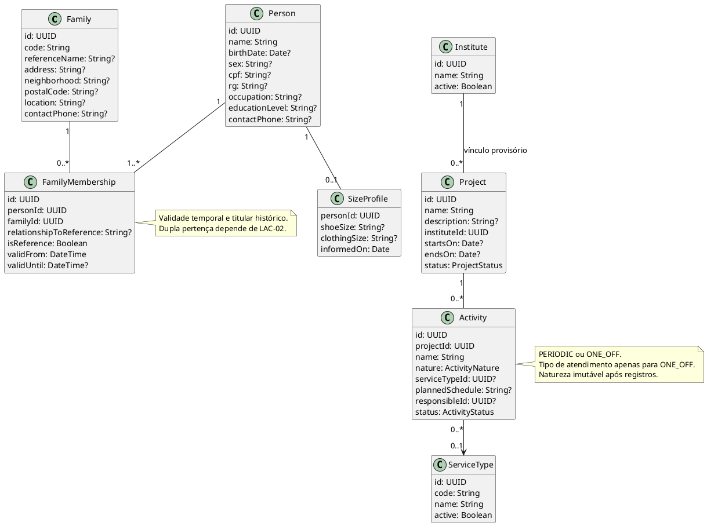
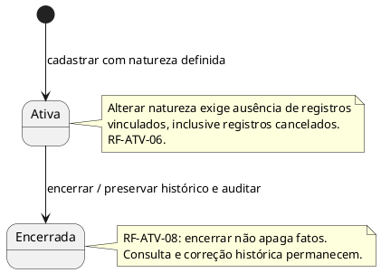
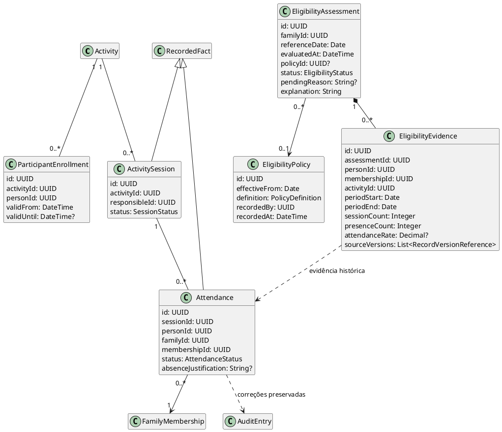
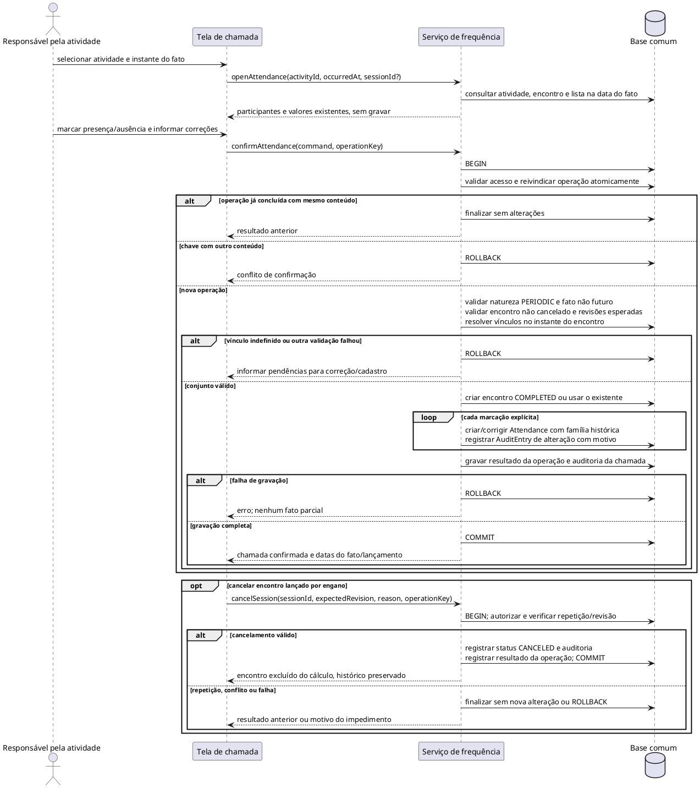
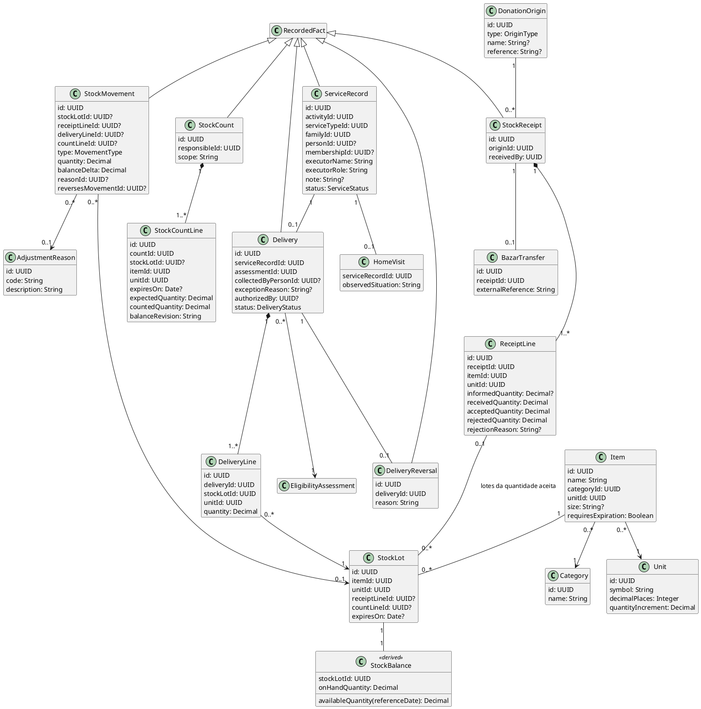
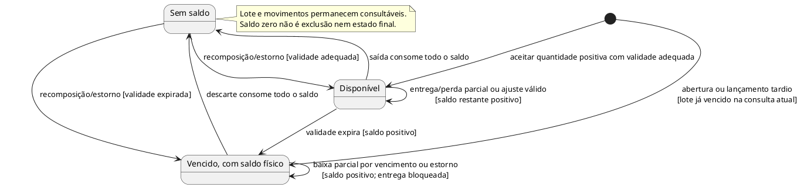
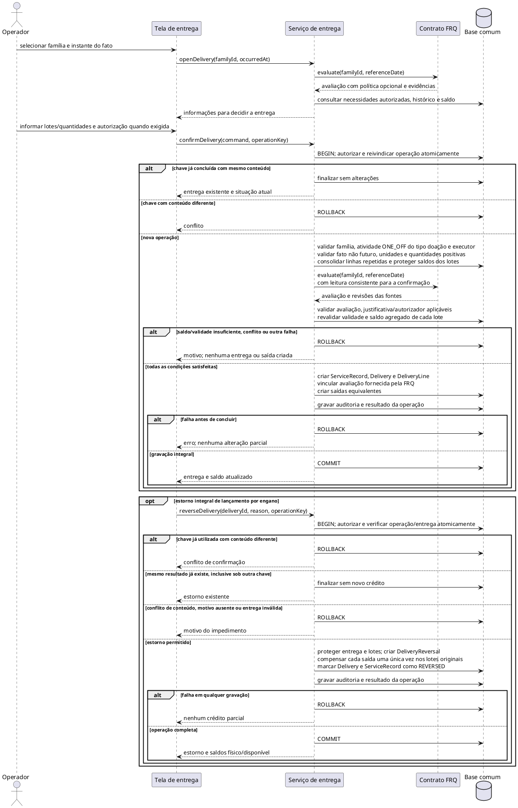
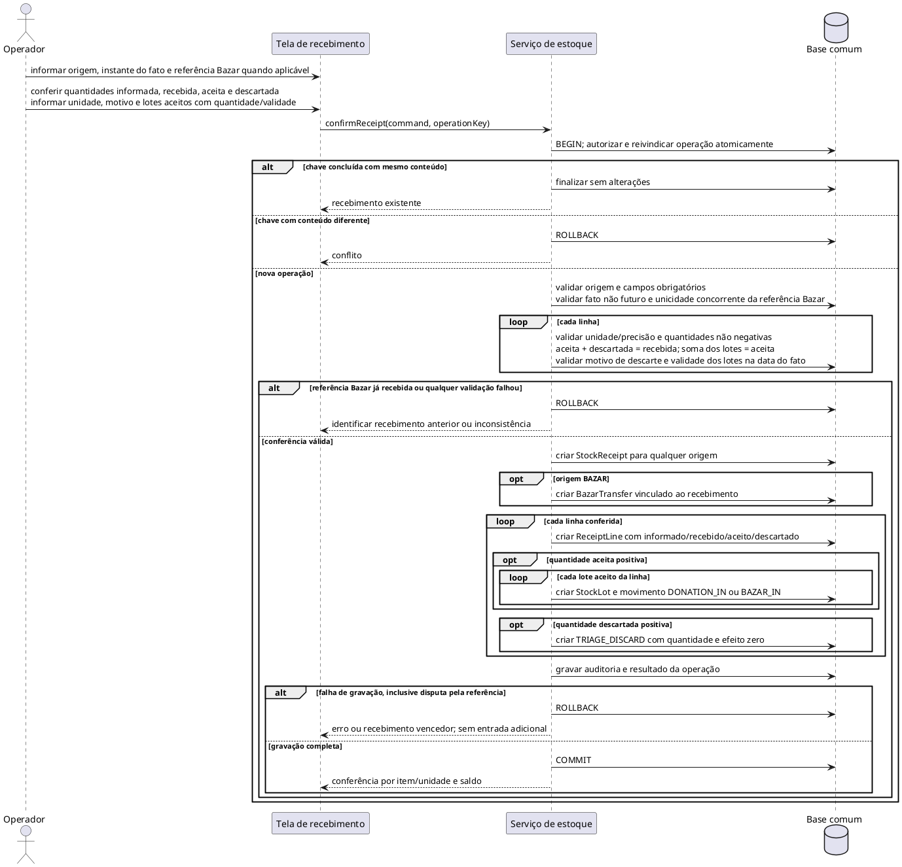
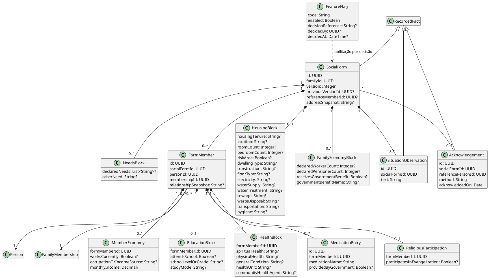
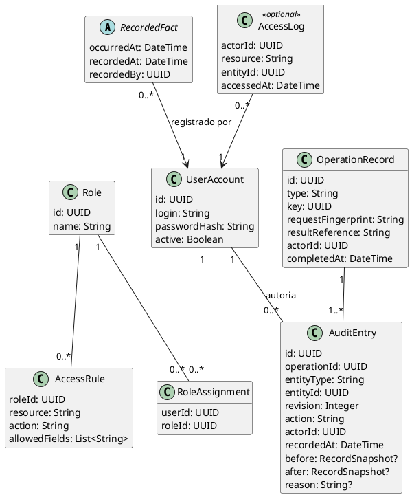

# Modelagem lógica do ERP Social — v1.1

## 1. Controle e contexto

| Campo | Valor |
|---|---|
| Arquivo | MODELAGEM-v1.md |
| Versão | 1.1 — revisão do modelo lógico |
| Data | 28/09/2026 |
| Situação | Revisado documentalmente; políticas pendentes de validação institucional |
| Escopo | Cadastro, atividades, frequência, aptidão, atendimentos, estoque, entregas, ficha e contratos transversais |
| Aprovação | A versão anterior declarava aprovação em plan-mode, sem registro verificável nesta pasta. Isso não comprova aprovação de negócio. |

O problema é substituir o Bússola Social preservando a assistência e o histórico familiar. Pessoas participam de atividades; a família reúne a situação social e o auxílio recebido. Presença, aptidão, atendimento realizado, disponibilidade de estoque e entrega são fatos distintos.

### 1.1 Fontes e autoridade

| Fonte disponível | Papel |
|---|---|
| [PRD 1.1](PRD-ERP-Luz-da-Esperanca-v1.1.md) | Referência canônica de negócio: CAP, RN, AC e DEC. |
| [ERS 1.0](<ERS — ERP Social Luz da Esperança.md>) | Detalhamento dos requisitos RF, RNF, RES e LAC; tratamentos provisórios sujeitos a ratificação. |
| [Ficha de Cadastro de Famílias 2025](ficha_cadastro_familias_2025.md) | Representação em Markdown do formulário; não torna seus campos obrigatórios no ERP. |
| [Pesquisa documental](Pesquisa-Documental-Sistemas-ERP-Social.md) | Contexto de mercado e continuidade operacional; não amplia o escopo. |
| [Bibliografia 1.1](Bibliografia-ERP-Social-v1.1.md) | Fundamentação e limites das conclusões documentais. |

A transcrição F1, a análise anterior ARQ e os PDFs citados na versão anterior não estão disponíveis nesta pasta. Afirmações provenientes deles são consideradas apenas na forma consolidada no PRD e na ERS; não se declara consulta direta nem se presume aprovação ausente.

Nenhuma política aberta é resolvida por este modelo: PRD §9.2 e ERS RES-06. A hierarquia instituto–projeto e o tratamento de entrega a família Não apta/Pendente seguem as propostas explícitas da ERS, identificadas como provisórias. Em caso de divergência de negócio, prevalece o PRD e registra-se a decisão antes da ativação.

### 1.2 Convenções e contratos comuns

- Explicações e rótulos de negócio estão em português; identificadores de classes, atributos e operações estão em inglês. Os IDs D-01 a D-10 são locais. Não se atribuem casos de uso UC à ERS, que não contém esse catálogo.
- Os diagramas são vistas do mesmo modelo. Classes repetidas sem atributos são referências à definição completa em outro diagrama. Chaves estrangeiras e associações representam a mesma relação, não duas fontes de verdade.
- `?` indica dado opcional ou ainda desconhecido. Ausência de informação não equivale a zero, falso, ausência em encontro ou incompatibilidade. Obrigatoriedade de campos cadastrais e sociais depende de LAC-02/LAC-05.
- `Date` representa data civil; `DateTime`, instante com fuso definido para a operação. A data de referência de aptidão é a data civil do fato. Intervalos de vínculo e participação usam início inclusivo e fim exclusivo; fim nulo significa sem término conhecido. Vigência de política usa datas, sem sobreposição.
- Registros operacionais identificam `occurredAt`, `recordedAt` e `recordedBy` por meio de `RecordedFact` (D-10). Executor/recebedor físico e operador que lançou são responsabilidades separadas.
- Alteração de registro existente exige revisão esperada, autorização e auditoria atômica com antes/depois. Conflito não sobrescreve outra alteração silenciosamente. Histórico é preservado no uso normal; guarda e eliminação seguem LAC-08, inclusive em auditoria e cópias.
- Operações repetíveis utilizam `OperationRecord` (D-10): chave única por tipo de operação, conteúdo normalizado e resultado. Mesma chave/conteúdo retorna o resultado anterior; conteúdo diferente é conflito. A reivindicação da chave e os efeitos são atômicos, inclusive sob concorrência. Falha não consome a chave. O mecanismo físico fica para ADR.
- Todo acesso, inclusive retorno de operação repetida, passa pela autorização vigente. Consultas, buscas, auditoria, relatórios e exportações respeitam a mesma matriz de acesso.
- Enquanto LAC-08 não estiver decidida, não há uso de dados pessoais reais em nenhum módulo. Demonstrações usam dados sintéticos. A liberação de cada função depende também das demais lacunas que a afetam.

### 1.3 Histórico de revisão

| Versão | Alteração |
|---|---|
| 1.0 | Nove diagramas com declaração de aprovação não verificável nesta pasta. |
| 1.1 | Correção de atomicidade, repetição, conferência do Bazar, lotes/validade, precisão de quantidades, aptidão pendente, vínculos históricos, ficha por pessoa, auditoria e rastreabilidade. |

## 2. Índice dos diagramas

Todos os diagramas abaixo são propostas técnicas revisadas. Sua presença não ativa funções nem resolve lacunas institucionais.

| ID | Assunto | Tipo | Dependências principais |
|---|---|---|---|
| D-01 | Cadastro e organização | Classes | LAC-02, LAC-04, LAC-12 |
| D-02 | Ciclo da atividade | Estados | RF-ATV-06, RF-ATV-08 |
| D-03 | Frequência e aptidão | Classes e contrato FRQ → AD | LAC-01, LAC-02, LAC-04 |
| D-04 | Lançamento e correção de chamada | Sequência | RF-FRQ-01 a RF-FRQ-07, RF-ACS-05 |
| D-05 | Atendimentos e estoque | Classes | LAC-03, LAC-06, LAC-07, LAC-13 |
| D-06 | Disponibilidade por lote | Estados derivados | RF-EST-04, RF-EST-09, RF-ENT-07 |
| D-07 | Entrega e estorno | Sequência | RF-ENT-01 a RF-ENT-07, RNF-CON-01 |
| D-08 | Recebimento e triagem | Sequência | RF-EST-03, RF-EST-04, RF-BAZ-01 a RF-BAZ-04 |
| D-09 | Ficha versionada e dados por membro | Classes | LAC-05, LAC-08 |
| D-10 | Autoria, acesso, auditoria e repetição | Classes | RF-ACS-01 a RF-ACS-06, LAC-08 |

Contratos complementares de duplicidade, relatórios e migração constam da seção 4. Modelo físico, APIs e mecanismos de concorrência são detalhados posteriormente, preservando estas garantias.

## 3. Diagramas e invariantes

### D-01 — Cadastro e organização

`Person` representa assistidos; usuários, executores e doadores não precisam tornar-se assistidos. Cada fato individual aponta para o vínculo familiar válido quando ocorreu. Encerrar ou corrigir um vínculo não transfere fatos anteriores para outra família (RF-CAD-05, RN-09).

**Invariantes e limites:**

- `Family.code` é único. Pessoa assistida e primeiro vínculo são cadastrados juntos. CPF, RG e telefone não condicionam assistência. Pela decisão de produto comunicada em 07/10/2026, CPF informado é validado pelo value object imutável `Cpf` e único entre pessoas canônicas; criação e edição bloqueiam repetições. DTOs e persistência representam seu valor por 11 dígitos ou `null`; a máscara pertence à apresentação. Ver [SPEC-CAD, §3](specs/02-registration.md#3-busca-dados-ausentes-e-duplicidades).
- A data de nascimento ausente é sinalizada, preservando RF-CAD-08. O mínimo de RF-CAD-11 e sua obrigatoriedade final precisam ser conciliados em LAC-02; não se inventa data para cadastrar alguém.
- Um titular por família em cada instante é a proposta da ERS §3.4. Troca de titular ou parentesco encerra a versão temporal anterior e abre outra; `isReference` não é sobrescrito retroativamente. Cadastro incompleto sinaliza a pendência, sem inventar titular.
- Número de membros conta pessoas distintas com vínculo vigente na data consultada. Pessoa com mais de um vínculo admissível no instante exige resolução explícita do contexto; nenhuma família é escolhida silenciosamente.
- `ProjectStatus` e `ActivityStatus`: `ACTIVE`, `CLOSED`. `ActivityNature`: `PERIODIC`, `ONE_OFF`. `ServiceType` é cadastro configurável, sem enum fechado para os tipos de atendimento (RF-ATV-05, RNF-MAN-01).
- Instituto único por projeto é a proposta provisória de LAC-04, não uma política confirmada pelo PRD. Horários, organização de encontros e inscrição continuam vinculados à mesma lacuna.
- Atualizações de tamanho têm data e auditoria. A inclusão para adultos continua sujeita a LAC-12; ausência de tamanho não prova incompatibilidade.

### D-02 — Ciclo da atividade

Encerramento preserva registros e permite sua consulta/correção. A situação atual não invalida um fato ocorrido durante a vigência anterior.

Projeto encerrado preserva suas atividades e fatos. Reabertura, suspensão e novas restrições de atendimento não são presumidas por este ciclo.

### D-03 — Frequência e aptidão

Inscrição é expectativa de participação. Somente presença em atividade periódica serve de evidência de aptidão. Justificativa de ausência não altera essa conclusão sem decisão em LAC-01.

**Frequência:**

- `SessionStatus`: `COMPLETED`, `CANCELED`; `AttendanceStatus`: `PRESENT`, `ABSENT`. Falta de lançamento é informação incompleta, não ausência automática.
- Uma presença por `(sessionId, personId)`. Não se presume encontro único por atividade/data: encontros distintos no mesmo dia têm identidades próprias; correções selecionam o encontro existente.
- Uma chamada só cria encontro realizado ao confirmar o fato. Abrir uma tela ou abandonar rascunho não altera relatórios.
- Lista e vínculo são resolvidos no instante do encontro: `validFrom <= occurredAt` e fim ausente ou posterior. `familyId` e `membershipId` ficam associados ao fato; mudança cadastral posterior não os recalcula.
- Participante fora da lista pode ter presença registrada se possui vínculo válido no fato. Isso não o inscreve automaticamente nos próximos encontros.
- Cancelamento auditado retira o encontro do denominador e das evidências. Correção/cancelamento mantém o conteúdo anterior em `AuditEntry`; não se registra presença nova em encontro cancelado.
- Cálculo percentual explicita encontros considerados, numerador e denominador. Denominador zero resulta em percentual desconhecido; não se presume 0% nem 100%.

**Critério e avaliação:**

`PolicyDefinition` é um valor lógico estruturado para período de referência, tipo e valor do mínimo, atividades consideradas, efeito de justificativas, recessos, novos participantes e tolerância. A forma exata depende de LAC-01. Não se limita antecipadamente o período a dias corridos nem se presume combinação entre mínimo absoluto e percentual. Todos os parâmetros necessários devem estar explícitos para ativar a versão.

`EligibilityStatus`: `ELIGIBLE` (Apta), `INELIGIBLE` (Não apta), `PENDING` (Pendente). Sem política vigente na data avaliada, `policyId=null`, resultado `PENDING` e motivo `POLICY_UNDEFINED`. Evidência insuficiente também gera `PENDING`, com a versão aplicável quando existir. `ELIGIBLE` e `INELIGIBLE` exigem política identificada e fundamentação; não se conclui Não apta por informação incompleta.

RN-02 e AC-02: basta pelo menos um membro cumprir o critério para a família ser Apta, mesmo que outros não participem ou tenham dados incompletos. Sem membro que comprove o critério, a família só é Não apta quando a evidência pertinente permite essa conclusão; se faltam dados necessários, fica Pendente. Aptidão permite considerar a família e não garante entrega (RN-03). O efeito de mudanças de composição sobre o período avaliado deve ser explicitado em LAC-01/LAC-02, preservando a família de cada fato histórico.

Cada nova política tem identidade, início de vigência e autor; não altera versões anteriores. A versão aplicável é a de maior início de vigência não posterior à referência, sem dois inícios iguais. Cada avaliação é um registro imutável de data, política e evidência conhecida naquele momento. `RecordVersionReference` identifica o fato e sua revisão auditada; uma correção pode produzir nova avaliação sem reescrever a usada em entrega anterior.

**Contrato FRQ → AD:** `evaluate(familyId, referenceDate)` retorna `assessmentId`, família, referência, instante da avaliação, situação, política opcional, motivo de pendência e evidências. AD não recalcula a aptidão. FRQ garante validade para a data pedida e para as revisões dos dados lidos: passagem do tempo, mudança de política, vínculo, presença ou cancelamento invalidam resultados reutilizáveis. Fila/cache não é requisito deste modelo. Na confirmação da entrega, a avaliação deve ser consistente com a leitura transacional ou ter suas revisões validadas antes da gravação.

RF-ENT-06 propõe justificativa e autorizador para Não apta/Pendente; não autoriza criar bloqueio automático por aptidão. Seu uso real depende de LAC-01/LAC-03 e da validação institucional prevista no PRD.

### D-04 — Lançamento e correção de chamada

A abertura apenas consulta. A confirmação valida o conjunto inteiro, grava os fatos e a auditoria na mesma operação. Uma correção informa revisão esperada e motivo; repetir a mesma confirmação não cria encontro ou correção adicional.

Atividade hoje encerrada não impede corrigir chamada histórica válida. Cadastro mínimo e resolução de vínculo acontecem antes de confirmar a chamada; presença não cria parentesco nem muda automaticamente a lista de participantes. O cancelamento só é considerado concluído quando situação, auditoria e resultado forem gravados juntos; qualquer falha reverte o conjunto.

### D-05 — Atendimentos e estoque

O catálogo `Item` descreve o material e sua unidade. `ReceiptLine` registra a conferência física; `StockLot` separa quantidades com a mesma origem e validade. Uma entrega consome quantidades de lotes, sem mudar o estado de todo o catálogo. Não há reserva obrigatória.

**Atendimentos e autoria — RF-ATD-01 a RF-ATD-08:**

- `ServiceRecord` sempre tem família e atividade `ONE_OFF`, com tipo compatível. Entrega exige o tipo de doação de itens; visita exige o tipo de visita domiciliar. Pessoa é opcional para atendimento à família; quando informada, seu vínculo no fato precisa corresponder à família registrada.
- `ServiceStatus`: `COMPLETED`, `CANCELED`, `REVERSED`. Executor tem nome/função mesmo sem conta. O operador vem de `RecordedFact`. `HomeVisit` é detalhe de atendimento à família, condicionado a LAC-13.
- Correção/cancelamento exige motivo, revisão esperada e `AuditEntry` com valores anteriores e novos. Não se usa um único campo de motivo para substituir o histórico.
- Atendimento com entrega não pode ser cancelado isoladamente: passa pelo estorno de D-07. Alterar itens, família ou quantidade de uma entrega concluída exige estorno e novo registro, preservando a operação original.
- Observações e situação encontrada seguem controle de acesso; texto livre não autoriza armazenar prontuário, diagnóstico ou prescrição (RES-05).

**Recebimento e conferência — RF-EST-02 a RF-EST-04; RF-BAZ-01 a RF-BAZ-04:**

- `OriginType`: `PERSON`, `ORGANIZATION`, `CAMPAIGN`, `BAZAR`, `AD_HOC`, `UNKNOWN`. O cadastro de origem é identificação mínima; não inclui gestão de relacionamento, valoração ou captação financeira.
- Todo recebimento tem origem explícita, inclusive `UNKNOWN` quando admitida pela política de LAC-06. Uma origem Bazar exige exatamente uma transferência; outra origem não pode ter transferência associada.
- `BazarTransfer.receiptId` e `externalReference` são únicos. A referência e todos os fatos do recebimento são persistidos juntos. Rascunhos não consomem referência nem produzem saldo.
- Linha do Bazar exige quantidade informada, inclusive quando nada chegou. `receivedQuantity - informedQuantity` é a divergência física; `acceptedQuantity + rejectedQuantity = receivedQuantity` é a conferência da triagem. Quantidades são não negativas; descarte positivo exige motivo.
- Recebimentos externos podem não ter quantidade anunciada; nesse caso `informedQuantity=null`, sem apresentar divergência inventada.
- Cada linha com quantidade aceita positiva gera um ou mais lotes, cada um com uma única entrada inicial. A soma dessas entradas equivale exatamente à quantidade aceita da linha. Descarte na triagem preserva quantidade e motivo, sem entrar ou sair do saldo distribuível. Linhas totalmente faltantes ou rejeitadas continuam no recebimento, mesmo sem lote.
- Material com validades diferentes ocupa lotes diferentes dentro da linha conferida. A quantidade informada pelo Bazar pertence à linha e não é repetida por lote. Validade é obrigatória em cada lote quando exigida pelo item. Material já vencido na data do recebimento não é aceito como distribuível; em lançamento tardio, lotes que venceram depois são registrados com disponibilidade atual zero. Critério de aceitação e limite de vencimento dependem de LAC-06.

**Quantidades, lotes e saldo — RF-EST-01, RF-EST-05 a RF-EST-10:**

- Quantidades usam decimal exato; precisão e incremento permitido pertencem à unidade, configurados em LAC-06. Precisão é não negativa; incremento é positivo e representável nessa precisão. Exemplo de representação: 0,5 kg. Não se arredonda uma quantidade para satisfazer o incremento.
- A unidade de linhas, lote e movimentos corresponde à do item. Não há conversão implícita. Sem regra de conversão aprovada/modelada, unidade divergente é rejeitada; isso atende à proibição de somar unidades incomparáveis.
- Categoria e unidade são cadastros configuráveis. Alterar a unidade de item com movimentos não reinterpreta quantidades antigas; é necessária identidade distinta ou migração explicitamente reconciliada.
- `StockLot` tem origem em exatamente uma linha de recebimento ou de contagem: saldo inicial e material identificado em contagem não precisam de doação fictícia. Linha de recebimento admite vários lotes; linha de contagem que inaugura estoque identifica um lote homogêneo. Repetir a confirmação não recria lotes nem suas entradas.
- `onHandQuantity` é a soma dos efeitos de movimentos no lote e nunca é negativa. `availableQuantity` exclui lotes vencidos na referência consultada. Vencimento bloqueia disponibilidade sem apagar o saldo físico; descarte posterior registra a baixa.
- Em consulta histórica, saldo físico e disponibilidade são reconstruídos com movimentos cuja data do fato não excede a referência e com a validade nessa mesma referência. Entradas posteriores não antecipam saldo. A confirmação de operação consulta também o saldo atual protegido contra concorrência; ele não é substituído pelo saldo histórico exibido.
- Item/tamanho/unidade agregam lotes compatíveis. Entrega parcial afeta apenas a quantidade retirada. Seleção de lote não presume prioridade automática de distribuição nem uma regra de separação ainda não validada.
- Ajuste, perda, avaria, vencimento e saldo inicial têm motivo, responsável e trilha. `StockCountLine` registra saldo observado no sistema, quantidade física e revisão usada. Diferença não altera estoque antes da confirmação do ajuste. Uma revisão desatualizada exige reconciliação, não aplicação silenciosa sobre outro saldo.
- Entrada positiva por contagem de material sem lote cria lote identificado por item/unidade/validade. A necessidade de conhecer validade não é dispensada pela origem em contagem.
- `StockMovement` é imutável no uso operacional. Retificações geram movimentos compensatórios e auditoria; eliminação institucional segue LAC-08. Cada movimento identifica sua origem estruturada, sem depender de texto livre.

| `MovementType` | Quantidade e efeito | Origem obrigatória |
|---|---|---|
| `DONATION_IN` / `BAZAR_IN` | Quantidade positiva; efeito `+quantity` | Linha de recebimento e lote aceito |
| `TRIAGE_DISCARD` | Quantidade descartada positiva; efeito zero | Linha de recebimento, sem lote |
| `DELIVERY_OUT` | Quantidade positiva; efeito `-quantity` | Linha de entrega e lote |
| `ADJUSTMENT_IN` / `ADJUSTMENT_OUT` | Quantidade positiva; efeito positivo/negativo | Motivo e lote; linha de contagem quando aplicável |
| `OPENING_BALANCE` | Quantidade positiva; efeito positivo | Contagem física e lote |
| `DELIVERY_REVERSAL` | Mesma quantidade da saída; efeito inverso | `reversesMovementId` apontando para `DELIVERY_OUT` |

`balanceDelta` é determinado pelo tipo; não é valor livre. O movimento de descarte deriva item/unidade da linha de recebimento; os demais derivam do lote. A origem deve existir e ser coerente com o movimento. Saldo após cada movimento é reconstruível em ordem determinística de contabilização; relatórios por data do fato identificam lançamentos retroativos. A confirmação de fato retroativo verifica também os saldos históricos afetados; inconsistência requer reconciliação, sem inventar entradas.

**Entrega e estorno — RF-ENT-01 a RF-ENT-07:**

- `Delivery.serviceRecordId` é único. Família e instante do fato correspondem ao atendimento; a avaliação pertence à mesma família e data. Cada linha corresponde a exatamente uma saída com mesmo lote, unidade e quantidade.
- `DeliveryStatus`: `COMPLETED`, `REVERSED`. Entrega concluída tem ao menos uma linha positiva. Linhas repetidas do mesmo lote são consolidadas para validar a quantidade total.
- Membro que retirou, se informado, deve pertencer à família na data do fato. Aptidão, justificativa e autorizador são preservados como contexto da confirmação.
- `DeliveryReversal.deliveryId` é único; `StockMovement.reversesMovementId` também é único quando preenchido. O fluxo cobre estorno integral de entrega lançada por engano, conforme RF-ENT-07; devoluções físicas parciais não são presumidas.
- Estorno recompõe os lotes originais e muda entrega/atendimento juntos. Se o lote venceu, a recomposição aumenta o saldo físico, mas continua indisponível para nova entrega.

### D-06 — Disponibilidade por lote

Os estados abaixo são derivados da quantidade e da validade de `StockLot`, não pertencem a `Item`. Recebimento, triagem e descarte anterior à aceitação são representados por `StockReceipt`/`ReceiptLine`/`TRIAGE_DISCARD`; somente a parte aceita entra em um lote.

A conferência de vencimento acontece na consulta e na confirmação, mesmo se nenhum processo agendado tiver executado. Lote inicial identificado como vencido em contagem é registrado diretamente como indisponível, conforme a política de LAC-06. Prazo do alerta de proximidade de vencimento não tem valor presumido.

### D-07 — Entrega e estorno

A consulta inicial é informativa. A confirmação repete as validações dentro da operação atômica, usando saldo protegido contra concorrência e aptidão obtida da FRQ para a data do fato. O requisito é a garantia; bloqueio, isolamento, atualização condicional e implantação ficam para ADR.

Duas confirmações de quatro unidades sobre saldo cinco não podem ambas concluir. Requisição repetida é resolvida antes de exigir saldo para uma nova saída; mudanças posteriores de saldo não impedem recuperar o resultado já concluído. Autorização de acesso continua obrigatória.

Se outra operação ganhar a mesma chave durante a confirmação, a perdedora não produz efeitos e recupera o resultado vencedor após conferir igualdade do conteúdo, conforme o contrato comum. Identidade do atendimento, linhas, movimentos e avaliação fica preservada para relatórios, sem contar entrega e atendimento como duas realizações.

Em lançamento tardio, a aptidão e a validade usam a data do fato, mantendo identificável a data de lançamento. O saldo físico atual e a consistência dos saldos históricos também são conferidos; registro retroativo não autoriza saldo negativo. A avaliação apurada posteriormente não é apresentada como decisão originalmente consultada no papel.

### D-08 — Recebimento e triagem

Abertura e edição apenas montam o comando. Recebimento, referência Bazar, linhas, lotes, movimentos, auditoria e resultado da operação são confirmados juntos. Nenhuma referência é consumida antes dessa confirmação.

Dez unidades informadas e oito recebidas, todas aceitas, produzem divergência de duas unidades faltantes, oito de entrada e nenhum descarte. O destino das divergências é definido em LAC-07; não se força sua conversão em descarte.

Reapresentação de referência já recebida com outra chave identifica o registro existente e não cria segunda entrada. Mesma chave/conteúdo retorna sucesso anterior. Falha ou abandono antes do commit deixa referência e chave disponíveis para nova tentativa. Recebimento sem quantidade aceita continua conferível e não altera o saldo.

### D-09 — Ficha versionada e dados por membro

A ficha é uma fotografia familiar datada. Cada versão possui membros identificados; renda, escolaridade, evangelização e informações de saúde não ficam soltas na família. O cadastro atual não substitui o contexto de uma ficha antiga. Os campos abaixo são candidatos derivados da ficha/ERS, condicionados à seleção de LAC-05; presença no diagrama não autoriza coleta.

**Versionamento e identidade — RF-FIC-01 a RF-FIC-09:**

- `(familyId, version)` é único; a versão anterior pertence à mesma família. Alteração de conteúdo publica uma nova versão completa, com autoria e data. Blocos e membros da versão anterior não são modificados por edição do cadastro ou da nova ficha.
- `FormMember` é único por pessoa dentro da versão, pertence à família da ficha e aponta para o vínculo selecionado na data do preenchimento. `referenceMemberId`, quando conhecido, aponta para um desses membros; trocar titular depois não altera essa referência histórica.
- Toda informação individual aponta ao `FormMember` daquela versão. Saúde e medicamentos seguem o titular registrado na ficha recebida; não se ampliam automaticamente para todos. Escolaridade e evangelização são registradas individualmente para crianças/adolescentes, conforme os campos aprovados.
- Endereço e parentesco usados para interpretar a ficha são preservados na versão. Dados atuais continuam no cadastro e não substituem esses valores históricos.
- Campos ausentes permanecem desconhecidos. Contagens econômicas são declaradas, identificadas como tal; não se transformam em uma pontuação de vulnerabilidade.
- RF-FIC-03 é evolução: se incluído, total/per capita derivam das rendas e membros da versão. Renda desconhecida não vira zero; soma parcial e denominador devem ser identificados. Não há classificação automática.
- Necessidades preservam alimento, vestuário, calçado, emprego, médico e outros conforme a seleção aprovada. A equipe de distribuição recebe apenas o subconjunto autorizado pela matriz.
- Texto livre de situação encontrada recebe data, autor e acesso restrito. A habilitação de um campo de observação não permite contornar o bloqueio de saúde/religião ou registrar prontuário.
- `Acknowledgement` registra a ciência conhecida, incluindo assinatura em papel e data. Ausência de registro significa não informado; não é consentimento presumido. A forma e a finalidade seguem LAC-08. Uma correção desse registro é auditada.
- Alerta de desatualização é RF-FIC-10, desejável, sem prazo padrão. Nenhum alerta impede atendimento automaticamente.

**Condição de uso com dados reais — LAC-05/LAC-08:**

As flags abaixo começam em `false`; não existe bloco social liberado por padrão:

| Flag | Condição para ativar |
|---|---|
| `REAL_PERSONAL_DATA` | Decisão registrada de LAC-08 sobre finalidades, acesso, guarda/eliminação e responsabilidades; demais lacunas da função também resolvidas. |
| `FIC_HOUSING`, `FIC_ECONOMY`, `FIC_NEEDS`, `FIC_SITUATION` | Seleção dos campos em LAC-05 e matriz de acesso aprovada em LAC-08. |
| `FIC_EDUCATION` | Aprovação dos dados de crianças/adolescentes em LAC-05/LAC-08, com identidade por membro. |
| `FIC_HEALTH`, `FIC_MEDICATION`, `FIC_RELIGION` | Aprovação específica da finalidade e dos campos, perfis autorizados e proteção correspondente. |
| `FIC_UPDATE_ALERT` | Prazo e responsabilidade definidos em LAC-05; evolução explicitamente incluída. |

Ativar uma flag exige referência, autor e data da decisão; a flag não substitui aprovação nem autorização por perfil. Todas as flags de bloco dependem de `REAL_PERSONAL_DATA` para uso real. Controles também se aplicam a importações, auditoria, exportações e observações de atendimentos. Dados sintéticos permitem validar os fluxos antes da liberação.

### D-10 — Autoria, acesso, auditoria e repetição

Este contrato atende à base comum; não se restringe às presenças ou aos dados sensíveis. A autoria de lançamento é diferente da execução física e permanece identificável após desativação de usuário.

- Login é individual e único; senha é representada apenas por hash apropriado (RF-ACS-01, RNF-SEG-01). Desativação não remove referências de autoria.
- A matriz da ERS §2.3 continua uma proposta sujeita a LAC-08. Nenhum perfil recebe acesso automaticamente por operar outro módulo; administração de contas não implica acesso à ficha.
- `AuditEntry` cobre criação, alteração, correção, cancelamento, estorno e unificação de todas as entidades relevantes, incluindo cadastro, vínculo, ficha, política, atendimento e estoque (RF-ACS-04). Catálogos e configurações também têm alterações identificáveis.
- `RecordSnapshot` preserva os valores necessários para reconstruir a revisão, incluindo justificativas anteriores; não copia senhas ou segredos. `RecordVersionReference` em D-03 identifica `entityType`, `entityId` e `revision`. Alterar um registro e gravar auditoria é uma única operação.
- Correção, cancelamento, estorno, ajuste e unificação exigem motivo. Em criação, `before=null`; a ausência de motivo não é usada para omitir autor/data/conteúdo. Revisões históricas não são editáveis no uso normal.
- Auditoria recebe a proteção dos dados que contém. Permissão para frequência não permite recuperar renda, saúde ou religião pelo histórico de alterações. Retenção e eliminação também abrangem essas cópias.
- `OperationRecord` é único por `(type, key)` e contém resultado apenas de operação concluída. Seu fingerprint considera os dados que determinam o efeito; não guarda um segundo payload irrestrito com dados pessoais. Tipos/chaves pertencem ao comando, não ao momento de abrir a tela.
- Concorrentes com a mesma chave têm um único efeito. Identidades de negócio, como referência Bazar e entrega estornada, continuam únicas mesmo com chaves diferentes. Falhas liberam tentativa sem permitir efeito parcial.
- `AccessLog` corresponde a RF-ACS-07, desejável; não é requisito adicional obrigatório para habilitar a ficha. Se incluído, registra consultas autorizadas sem ampliar o acesso.
- Auditoria de importação identifica o operador/importador e o lançamento atual, preservando datas/autores de origem quando disponíveis. Dados históricos desconhecidos não recebem autoria inventada.

## 4. Contratos complementares e cobertura

### 4.1 Duplicidade e unificação

RF-CAD-06, RF-CAD-07, RF-REL-09 e AC-15 exigem busca prévia e tratamento identificado. A busca considera nome, nascimento, CPF e endereço disponíveis; semelhança não produz fusão automática.

O registro lógico de análise de duplicidade guarda `entityType`, `candidateIds`, `identifiedAt`, `resolvedAt?`, `resolution?` e `resolvedBy?`. A decisão de unificação registra origem, destino, autor e motivo, mantendo o mapeamento das identidades anteriores.

Unificação é atômica com auditoria e atualização coerente das referências. Conflitos de duas presenças no mesmo encontro, vínculos sobrepostos, titularidade, fichas e operações de estoque exigem reconciliação explícita; não se descartam registros nem se contabiliza duas vezes o mesmo fato. O histórico continua recuperável por referências anteriores, inclusive as usadas em avaliações de aptidão. Critérios institucionais ficam em LAC-02.

### 4.2 Relatórios e histórico

RF-REL-01 a RF-REL-09 são consultas sobre os fatos e versões acima, sem outro saldo ou cadastro paralelo.

- Histórico familiar usa a família registrada no fato; histórico pessoal reúne seus vínculos e fatos ao longo do tempo. Alteração do cadastro atual não transfere assistência passada.
- Relatório de alcance distingue pessoas únicas, famílias únicas, encontros realizados, atendimentos e quantidades por item/unidade. Entrega corresponde a um atendimento; não se somam ambos como dois atendimentos (RN-19, AC-10).
- Cancelamentos/estornos não entram como realizações válidas nos totais operacionais, mas permanecem consultáveis com seus efeitos e motivos. Estoque conserva as saídas originais e os movimentos inversos; não se apagam ambos do cálculo.
- Saldo inicial + efeitos das entradas/saídas/ajustes/estornos = saldo final físico. Disponibilidade exclui quantidade vencida sem apagar o físico. Descarte de triagem tem efeito zero; transferência Bazar não compõe nova arrecadação externa.
- Período, unidade, referência temporal, situação dos registros e critério de contagem acompanham cada total. A lista de origem do total usa os mesmos filtros e permissões. Retificações tardias são identificáveis, sem apresentar versão atual como relatório original.
- CSV/PDF continuam desejáveis (RF-REL-10). A condição de acesso é a mesma das consultas e não depende de a saída ser uma tela.

### 4.3 Migração e abertura do estoque

CAP-12 é parte do mínimo; não é retirado do produto por o formato de exportação ser desconhecido. O contrato lógico de RF-MIG-01 a RF-MIG-06 permanece necessário:

| Registro lógico | Conteúdo e garantia |
|---|---|
| `ImportBatch` | Origem, data de importação, operador, conjunto de arquivos identificado, contagens por tipo/período e resultado da conferência. |
| `ImportRecord` | Lote, tipo/identidade estável de origem, identidade de destino, situação e motivo de rejeição quando houver. |
| Identificação no destino | Cada fato importado conserva origem, data da importação e acesso à correspondência de origem. |

A identidade de origem deve ser estável entre execuções, não apenas dentro de um lote de importação. Quando não houver ID exportado, a estratégia de correspondência precisa ser definida e conferida em LAC-11; não se promete deduplicação sem essa definição. Mesma identidade não gera novo destino; conteúdo alterado exige atualização auditada ou revisão, sem sobrescrita silenciosa.

Famílias, pessoas e vínculos são conferidos antes dos fatos dependentes. Rejeições não aparecem como dados migrados. Histórico indisponível exige alternativa de consulta acordada pela instituição. Entrada em produção e encerramento do Bússola dependem de conferência, continuidade e aceite — AC-12/AC-13.

Saldo inicial vem de `StockCount` e `OPENING_BALANCE` por item/unidade/lote/validade. Se movimentos históricos forem importados, a data de corte e a conciliação impedem somá-los novamente ao saldo inicial. Importação não contorna autorização de dados reais nem de campos desativados.

### 4.4 Mapa de rastreabilidade

| Capacidade | Modelo/contrato | Requisitos e aceite principais |
|---|---|---|
| CAP-01 — Pessoas e famílias | D-01, D-10, §4.1 | RF-CAD-01 a RF-CAD-11; AC-01, AC-08, AC-15 |
| CAP-02 — Ficha social | D-09, D-10 | RF-FIC-01 a RF-FIC-10; LAC-05/LAC-08 |
| CAP-03 — Projetos e atividades | D-01, D-02 | RF-ATV-01 a RF-ATV-08; RF-ATV-09 como evolução |
| CAP-04 — Frequência | D-03, D-04 | RF-FRQ-01 a RF-FRQ-08; AC-08, AC-18 |
| CAP-05 — Aptidão | D-03, D-07 | RF-APT-01 a RF-APT-07; AC-02, AC-03, AC-14 |
| CAP-06 — Atendimentos | D-05, D-10 | RF-ATD-01 a RF-ATD-08; AC-04, AC-16; RF-ATD-09 como evolução |
| CAP-07 — Estoque | D-05, D-06, D-08 | RF-EST-01 a RF-EST-10; AC-11; RF-EST-11 como evolução |
| CAP-08 — Entregas | D-05, D-07 | RF-ENT-01 a RF-ENT-07; AC-05, AC-06, AC-10 |
| CAP-09 — Bazar | D-05, D-08 | RF-BAZ-01 a RF-BAZ-04, INT-01; AC-07 |
| CAP-10 — Histórico e resultados | §4.2 | RF-REL-01 a RF-REL-09; RF-REL-10 como evolução |
| CAP-11 — Acesso e autoria | D-09, D-10 | RF-ACS-01 a RF-ACS-06, RNF-SEG-04; AC-09; RF-ACS-07 como evolução |
| CAP-12 — Substituição do Bússola | §4.3 | RF-MIG-01 a RF-MIG-06, INT-02; AC-12, AC-13 |

O mapa indica cobertura lógica, não implementação ou aprovação. Requisitos desejáveis citados não são ativados automaticamente. Metas de desempenho, disponibilidade, backup, restauração e operação permanecem na ERS para o projeto técnico e o piloto.

## 5. Decisões pendentes

As condições abaixo indicam o momento da decisão, não atribuem aprovação. É possível revisar e demonstrar a modelagem com dados sintéticos enquanto as decisões não chegam.

| Lacuna | Condição que depende da decisão |
|---|---|
| LAC-01 / DEC-02 | Definição completa de frequência válida, período, atividades, evidência incompleta, justificativas e tolerâncias. Sem critério, aptidão Pendente; não se inventa um padrão. |
| LAC-02 / DEC-01 | Núcleo familiar, dupla pertença, titularidade, documentos, dados incompletos e reconciliação de duplicidades; antes de cadastros reais. |
| LAC-03 / DEC-03 | Exceções e quem autoriza entregas, além de prioridade/limites/intervalos. A parte de autorização afeta o fluxo mínimo, não apenas EVO-05. |
| LAC-04 / DEC-04 | Instituto–projeto, organização dos encontros, horários e lista de participantes; turmas/vagas/agenda apenas se incluídas como evolução. |
| LAC-05 / DEC-05 | Seleção campo a campo da ficha, finalidade, obrigatoriedade e atualização; afeta blocos comuns e sensíveis. |
| LAC-06 / DEC-06 | Unidades, precisão, categorias, triagem, validade/alertas, contagem, ajustes e estornos; antes do estoque real. |
| LAC-07 / DEC-07 | Referência Bazar, comunicação, conferência e encaminhamento das divergências; sem fluxo inverso confirmado. |
| LAC-08 / DEC-08 | Finalidades e bases aplicáveis, matriz de acesso, guarda/eliminação, ciência e responsabilidades; antes de qualquer dado pessoal real. |
| LAC-09 / DEC-09 | Responsabilidade por doadores/campanhas e valoração; mínimo conserva apenas identificação da origem. |
| LAC-10 / DEC-10 | Volumes, equipamentos, horários, produto, operação, manutenção e custos; antes de compromissos de desempenho e implantação. |
| LAC-11 / DEC-11 | Exportação, identidade de origem, históricos, corte, conciliação e continuidade; antes da migração real e substituição do Bússola. |
| LAC-12 | Coleta de tamanhos para adultos e inclusão da consulta de compatibilidade. |
| LAC-13 | Natureza e conteúdo da visita domiciliar; tipo de atendimento familiar ainda provisório. |

## 6. Limites do escopo

- Não há frequência mínima, janela de 30 dias, percentual ou renovação por doação presumidos.
- Não há pontuação de vulnerabilidade, prioridade por renda, intervalo obrigatório entre entregas, suspensão de famílias ou política emergencial criada pelo modelo.
- Compatibilidade é EVO-01/RF-ENT-08: caso incluída, distingue tamanho compatível de desconhecido e mantém decisão humana, sem tolerância presumida. Prioridade/limites são EVO-05/RF-ENT-09.
- Consolidação monetária por doador/campanha é EVO-02; alertas de interrupção e ficha são EVO-03; turmas, vagas, fila e agenda são EVO-04. Não são pré-requisitos ocultos do ciclo mínimo.
- O fluxo confirmado é Bazar → social. Retorno ao Bazar, CRM financeiro, estoque comercial, caixa, contabilidade, Escola Espírita e gestão de voluntários não são incorporados.
- Atendimento de saúde comprova realização; prontuário, diagnóstico e prescrição ficam fora.
- Esta revisão não define banco, linguagem, endpoints, índices, fila, infraestrutura ou mecanismo físico de concorrência. O projeto técnico deve demonstrar as garantias de atomicidade, unicidade, auditoria e acesso descritas aqui.

## 7. Cenários para conferência da modelagem

Estes cenários são verificações de mesa e referências para testes futuros; não são relato de execução de um sistema implementado.

| Cenário | Resultado exigido | Local |
|---|---|---|
| Duas entregas de quatro unidades disputam saldo cinco | No máximo uma conclui; saldo não negativo e nenhum atendimento parcial | D-07 |
| Confirmação de entrega é repetida após perda da resposta | Mesmo resultado, sem nova saída, mesmo que o saldo tenha mudado depois | D-07, D-10 |
| Mesma chave é reutilizada com outra quantidade | Conflito, sem efeito adicional | §1.2, D-10 |
| Estorno é repetido com a mesma chave ou outra | Um único crédito por saída original; retorno do estorno existente | D-05, D-07 |
| Falha no meio de entrega, estorno ou recebimento | Reversão integral, inclusive auditoria e registro da operação | D-07, D-08 |
| Recebimento Bazar falha antes do commit e é tentado novamente | Referência continua utilizável; só a confirmação integral produz recebimento | D-08 |
| Mesma referência Bazar chega com outra chave | Segundo recebimento impedido, registro anterior identificável | D-05, D-08 |
| Bazar informa dez, chegam oito, todas aceitas | Divergência de duas faltantes, oito de entrada, zero descartadas | D-08 |
| Uma linha anuncia dez unidades, recebidas em dois lotes de quatro e seis | Dez informadas uma única vez; dez recebidas/aceitas, com validade própria por lote | D-05, D-08 |
| Cinco unidades recebidas, três aceitas e duas descartadas | Saldo aumenta três; duas descartadas permanecem rastreáveis com efeito zero | D-05, D-08 |
| Mesmo item tem lotes com vencimentos distintos | Só os lotes adequados compõem a disponibilidade na data consultada | D-05, D-06 |
| Estorno devolve saldo a lote agora vencido | Saldo físico aumenta; disponibilidade continua zero | D-06, D-07 |
| Entrada de 0,5 kg em unidade que admite esse incremento | Quantidade exata preservada; nenhuma conversão ou arredondamento implícito | D-05 |
| Não há política na data avaliada | Pendente com critério nulo e motivo explícito | D-03 |
| Só um membro comprova o critério, outros não participam ou têm dados incompletos | Família Apta com a evidência desse membro; entrega não é garantida | D-03 |
| Política existe, mas faltam evidências | Pendente com a versão aplicável, sem negativa automática | D-03 |
| Critério muda ou chamada antiga é corrigida | Nova consulta usa referência/política/revisões corretas; avaliação anterior é preservada | D-03 |
| Chamada antiga é lançada após mudança de família | Lista e vínculo do instante original; histórico permanece naquela família | D-03, D-04 |
| Participante presente está fora da lista | Presença permitida com vínculo válido, sem inscrição automática | D-04 |
| Tela de chamada é aberta e abandonada | Nenhum encontro realizado ou presença é criado | D-04 |
| Duas crianças têm séries e evangelização diferentes | Dados separados por membro e versão da ficha | D-09 |
| Titular muda após ficha de saúde preenchida | Informação continua ligada ao titular registrado naquela versão | D-09 |
| Atendimento é corrigido ou cancelado | Antes/depois, operador, data e motivo recuperáveis por perfil autorizado | D-05, D-10 |
| Perfil de frequência tenta acessar renda via auditoria | Acesso não permitido, assim como na ficha e nas exportações | D-10 |
| Flag social é ativada sem decisão/global de dados reais | Uso real permanece não autorizado | D-09 |
| Uma família recebe duas entregas | Uma família, dois atendimentos de entrega e quantidades por unidade | §4.2 |
| Importação é repetida ou inclui abertura mais histórico | Sem duplicação por identidade de origem; saldo conciliado no corte | §4.3 |
